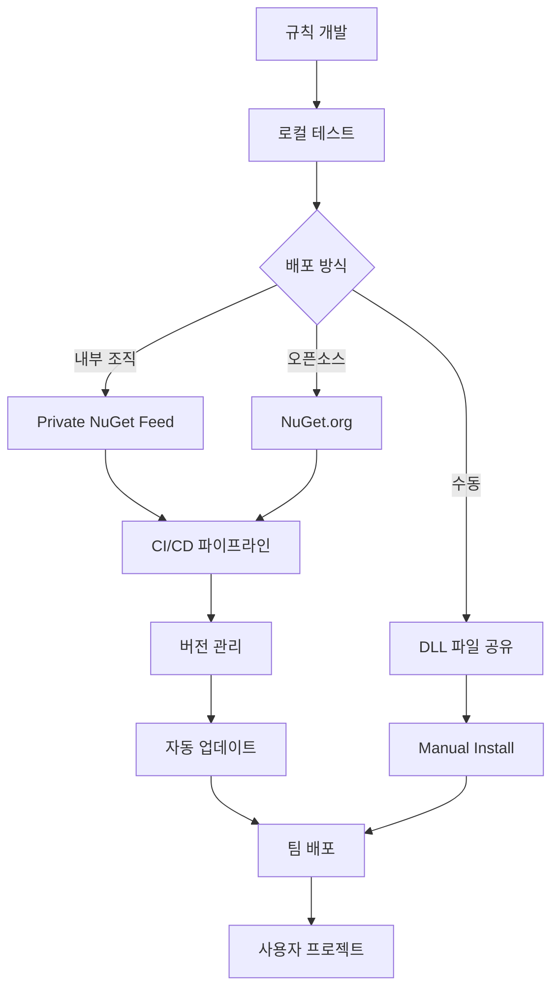

# TwinCatQA 플러그인 시스템 설계 (Part 2)

## 4.2 JSON 설정 파일 형식

```json
{
  "$schema": "https://twincat-qa.com/schemas/config.schema.json",
  "global": {
    "defaultMode": "Full",
    "enableParallelProcessing": true,
    "maxDegreeOfParallelism": 4,
    "timeoutSeconds": 300,
    "logLevel": "Info"
  },
  "plugins": {
    "sources": [
      {
        "type": "Assembly",
        "path": "./plugins/CompanyRules.dll",
        "enabled": true
      },
      {
        "type": "NuGetPackage",
        "packageId": "TwinCatQA.Rules.Industrial",
        "version": "2.1.0",
        "enabled": true
      }
    ],
    "customRulesPath": "./custom-rules"
  },
  "rules": {
    "enableAllRules": true,
    "configurations": {
      "FR-1-COMPLEXITY": {
        "enabled": true,
        "severity": "High",
        "parameters": {
          "maxComplexity": 10,
          "warnThreshold": 7
        },
        "excludePatterns": ["**/Legacy/**"]
      }
    }
  },
  "reports": {
    "generateHtml": true,
    "generateJson": true,
    "outputPath": ".twincat-qa/reports"
  }
}
```

### 4.3 JSON Schema 정의

```json
{
  "$schema": "http://json-schema.org/draft-07/schema#",
  "$id": "https://twincat-qa.com/schemas/config.schema.json",
  "title": "TwinCatQA Configuration",
  "description": "TwinCatQA 품질 검증 도구 설정 스키마",
  "type": "object",
  "properties": {
    "global": {
      "type": "object",
      "properties": {
        "defaultMode": {
          "type": "string",
          "enum": ["Full", "Incremental", "Quick"],
          "default": "Full",
          "description": "기본 검증 모드"
        },
        "enableParallelProcessing": {
          "type": "boolean",
          "default": true,
          "description": "병렬 처리 활성화"
        },
        "maxDegreeOfParallelism": {
          "type": "integer",
          "minimum": 1,
          "maximum": 32,
          "default": 4,
          "description": "최대 병렬 스레드 수"
        },
        "timeoutSeconds": {
          "type": "integer",
          "minimum": 10,
          "default": 300,
          "description": "타임아웃 (초)"
        },
        "logLevel": {
          "type": "string",
          "enum": ["Debug", "Info", "Warning", "Error"],
          "default": "Info",
          "description": "로깅 수준"
        }
      }
    },
    "plugins": {
      "type": "object",
      "properties": {
        "sources": {
          "type": "array",
          "items": {
            "$ref": "#/definitions/pluginSource"
          },
          "description": "플러그인 소스 목록"
        },
        "customRulesPath": {
          "type": "string",
          "description": "커스텀 규칙 디렉토리 경로"
        },
        "autoUpdate": {
          "type": "object",
          "properties": {
            "enabled": {
              "type": "boolean",
              "default": false
            },
            "schedule": {
              "type": "string",
              "enum": ["daily", "weekly", "monthly"]
            },
            "allowPrerelease": {
              "type": "boolean",
              "default": false
            }
          }
        }
      }
    },
    "rules": {
      "type": "object",
      "properties": {
        "enableAllRules": {
          "type": "boolean",
          "default": true,
          "description": "모든 규칙 활성화"
        },
        "configurations": {
          "type": "object",
          "additionalProperties": {
            "$ref": "#/definitions/ruleConfiguration"
          },
          "description": "규칙별 설정"
        }
      }
    },
    "reports": {
      "type": "object",
      "properties": {
        "generateHtml": {
          "type": "boolean",
          "default": true
        },
        "generatePdf": {
          "type": "boolean",
          "default": false
        },
        "generateJson": {
          "type": "boolean",
          "default": true
        },
        "outputPath": {
          "type": "string",
          "default": ".twincat-qa/reports"
        },
        "includeSourceCode": {
          "type": "boolean",
          "default": true
        }
      }
    }
  },
  "definitions": {
    "pluginSource": {
      "type": "object",
      "required": ["type", "enabled"],
      "properties": {
        "type": {
          "type": "string",
          "enum": ["BuiltIn", "Assembly", "SourceCode", "NuGetPackage", "RemoteApi"],
          "description": "플러그인 타입"
        },
        "path": {
          "type": "string",
          "description": "플러그인 파일 경로"
        },
        "packageId": {
          "type": "string",
          "description": "NuGet 패키지 ID"
        },
        "version": {
          "type": "string",
          "pattern": "^\\d+\\.\\d+\\.\\d+(-[a-zA-Z0-9]+)?$",
          "description": "패키지 버전 (Semantic Versioning)"
        },
        "endpoint": {
          "type": "string",
          "format": "uri",
          "description": "원격 API 엔드포인트"
        },
        "apiKey": {
          "type": "string",
          "description": "API 키"
        },
        "enabled": {
          "type": "boolean",
          "default": true,
          "description": "플러그인 활성화 여부"
        }
      }
    },
    "ruleConfiguration": {
      "type": "object",
      "properties": {
        "enabled": {
          "type": "boolean",
          "default": true,
          "description": "규칙 활성화"
        },
        "severity": {
          "type": "string",
          "enum": ["Info", "Low", "Medium", "High", "Critical"],
          "description": "위반 심각도"
        },
        "parameters": {
          "type": "object",
          "description": "규칙별 파라미터"
        },
        "excludePatterns": {
          "type": "array",
          "items": {
            "type": "string"
          },
          "description": "제외 패턴 (Glob)"
        }
      }
    }
  }
}
```

### 4.4 설정 서비스 구현

```csharp
namespace TwinCatQA.Application.Configuration
{
    /// <summary>
    /// 확장된 설정 서비스
    /// YAML과 JSON을 모두 지원하며, 환경 변수 치환 기능 제공
    /// </summary>
    public class ConfigurationService : IConfigurationService
    {
        private readonly ILogger<ConfigurationService> _logger;
        private readonly IFileSystem _fileSystem;
        private QualitySettings _cachedSettings;

        // 설정 파일 우선순위
        private readonly string[] _configFileNames = new[]
        {
            ".twincat-qa.yml",
            ".twincat-qa.yaml",
            ".twincat-qa.json",
            "twincat-qa.config.yml",
            "twincat-qa.config.json"
        };

        public async Task<QualitySettings> LoadConfigurationAsync(string profileName = null)
        {
            // 캐시된 설정 반환
            if (_cachedSettings != null)
                return _cachedSettings;

            // 설정 파일 검색
            var configPath = FindConfigurationFile();
            if (configPath == null)
            {
                _logger.LogWarning("설정 파일을 찾을 수 없습니다. 기본 설정을 사용합니다.");
                return GetDefaultSettings();
            }

            _logger.LogInformation("설정 파일 로드: {Path}", configPath);

            // 파일 확장자에 따라 파서 선택
            var settings = Path.GetExtension(configPath).ToLower() switch
            {
                ".yml" or ".yaml" => await LoadYamlConfigAsync(configPath),
                ".json" => await LoadJsonConfigAsync(configPath),
                _ => throw new NotSupportedException($"지원하지 않는 설정 파일 형식: {configPath}")
            };

            // 프로필 적용
            if (!string.IsNullOrEmpty(profileName))
            {
                ApplyProfile(settings, profileName);
            }

            // 환경 변수 치환
            SubstituteEnvironmentVariables(settings);

            // 설정 검증
            ValidateConfiguration(settings);

            _cachedSettings = settings;
            return settings;
        }

        private string FindConfigurationFile()
        {
            var currentDir = Directory.GetCurrentDirectory();

            // 현재 디렉토리부터 상위로 검색
            while (currentDir != null)
            {
                foreach (var fileName in _configFileNames)
                {
                    var path = Path.Combine(currentDir, fileName);
                    if (_fileSystem.FileExists(path))
                    {
                        return path;
                    }
                }

                // 부모 디렉토리로 이동
                var parent = Directory.GetParent(currentDir);
                currentDir = parent?.FullName;
            }

            return null;
        }

        private async Task<QualitySettings> LoadYamlConfigAsync(string path)
        {
            var yaml = await File.ReadAllTextAsync(path);
            var deserializer = new DeserializerBuilder()
                .WithNamingConvention(CamelCaseNamingConvention.Instance)
                .Build();

            return deserializer.Deserialize<QualitySettings>(yaml);
        }

        private async Task<QualitySettings> LoadJsonConfigAsync(string path)
        {
            var json = await File.ReadAllTextAsync(path);
            return JsonSerializer.Deserialize<QualitySettings>(json, new JsonSerializerOptions
            {
                PropertyNameCaseInsensitive = true,
                ReadCommentHandling = JsonCommentHandling.Skip
            });
        }

        private void ApplyProfile(QualitySettings settings, string profileName)
        {
            if (settings.Profiles == null || !settings.Profiles.ContainsKey(profileName))
            {
                _logger.LogWarning("프로필을 찾을 수 없습니다: {Profile}", profileName);
                return;
            }

            var profile = settings.Profiles[profileName];

            // 프로필 설정 병합 (Deep merge)
            if (profile.Global != null)
            {
                MergeGlobalSettings(settings.Global, profile.Global);
            }

            if (profile.Rules?.Configurations != null)
            {
                foreach (var (ruleId, config) in profile.Rules.Configurations)
                {
                    settings.Rules.Configurations[ruleId] = config;
                }
            }

            _logger.LogInformation("프로필 적용: {Profile}", profileName);
        }

        private void SubstituteEnvironmentVariables(QualitySettings settings)
        {
            // 환경 변수 패턴: ${VAR_NAME}
            var envVarPattern = new Regex(@"\$\{([^}]+)\}");

            // 재귀적으로 모든 문자열 속성 처리
            SubstituteObject(settings, envVarPattern);
        }

        private void SubstituteObject(object obj, Regex pattern)
        {
            if (obj == null) return;

            var type = obj.GetType();
            foreach (var prop in type.GetProperties())
            {
                if (prop.PropertyType == typeof(string))
                {
                    var value = (string)prop.GetValue(obj);
                    if (value != null)
                    {
                        var substituted = pattern.Replace(value, match =>
                        {
                            var varName = match.Groups[1].Value;
                            var envValue = Environment.GetEnvironmentVariable(varName);

                            if (envValue == null)
                            {
                                _logger.LogWarning(
                                    "환경 변수를 찾을 수 없습니다: {VarName}",
                                    varName);
                                return match.Value;
                            }

                            return envValue;
                        });

                        prop.SetValue(obj, substituted);
                    }
                }
                else if (!prop.PropertyType.IsValueType)
                {
                    // 중첩 객체 재귀 처리
                    var nestedObj = prop.GetValue(obj);
                    if (nestedObj != null)
                    {
                        if (nestedObj is IEnumerable enumerable && !(nestedObj is string))
                        {
                            foreach (var item in enumerable)
                            {
                                SubstituteObject(item, pattern);
                            }
                        }
                        else
                        {
                            SubstituteObject(nestedObj, pattern);
                        }
                    }
                }
            }
        }

        private void ValidateConfiguration(QualitySettings settings)
        {
            var errors = new List<string>();

            // 전역 설정 검증
            if (settings.Global.MaxDegreeOfParallelism < 1 || settings.Global.MaxDegreeOfParallelism > 32)
            {
                errors.Add("MaxDegreeOfParallelism은 1-32 범위여야 합니다.");
            }

            if (settings.Global.TimeoutSeconds < 10)
            {
                errors.Add("TimeoutSeconds는 최소 10초 이상이어야 합니다.");
            }

            // 플러그인 소스 검증
            foreach (var source in settings.Plugins?.Sources ?? Enumerable.Empty<PluginSource>())
            {
                if (source.Type == PluginType.Assembly || source.Type == PluginType.SourceCode)
                {
                    if (string.IsNullOrEmpty(source.Path))
                    {
                        errors.Add($"플러그인 소스의 Path가 필요합니다: {source.Type}");
                    }
                }
                else if (source.Type == PluginType.NuGetPackage)
                {
                    if (string.IsNullOrEmpty(source.PackageId))
                    {
                        errors.Add("NuGet 플러그인의 PackageId가 필요합니다.");
                    }
                }
                else if (source.Type == PluginType.RemoteApi)
                {
                    if (string.IsNullOrEmpty(source.Endpoint))
                    {
                        errors.Add("원격 API 플러그인의 Endpoint가 필요합니다.");
                    }
                }
            }

            if (errors.Any())
            {
                throw new ConfigurationException(
                    "설정 검증 실패:\n" + string.Join("\n", errors));
            }

            _logger.LogDebug("설정 검증 통과");
        }

        private QualitySettings GetDefaultSettings()
        {
            return new QualitySettings
            {
                Global = new GlobalSettings(),
                Rules = new RuleSettings(),
                Reports = new ReportSettings(),
                Git = new GitSettings()
            };
        }

        private void MergeGlobalSettings(GlobalSettings target, GlobalSettings source)
        {
            // null이 아닌 값만 병합
            if (source.DefaultMode != default)
                target.DefaultMode = source.DefaultMode;

            if (source.EnableParallelProcessing != default)
                target.EnableParallelProcessing = source.EnableParallelProcessing;

            if (source.MaxDegreeOfParallelism > 0)
                target.MaxDegreeOfParallelism = source.MaxDegreeOfParallelism;

            if (source.TimeoutSeconds > 0)
                target.TimeoutSeconds = source.TimeoutSeconds;

            if (!string.IsNullOrEmpty(source.LogLevel))
                target.LogLevel = source.LogLevel;
        }
    }

    /// <summary>
    /// 플러그인 소스 (확장)
    /// </summary>
    public class PluginSource
    {
        public PluginType Type { get; set; }
        public string Path { get; set; }
        public string PackageId { get; set; }
        public string Version { get; set; }
        public string Endpoint { get; set; }
        public string ApiKey { get; set; }
        public bool Enabled { get; set; } = true;
    }

    /// <summary>
    /// 설정 예외
    /// </summary>
    public class ConfigurationException : Exception
    {
        public ConfigurationException(string message) : base(message) { }
        public ConfigurationException(string message, Exception inner) : base(message, inner) { }
    }
}
```

---

## 5. 규칙 패키지 배포 방식

### 5.1 NuGet 패키지 구조

```
TwinCatQA.Rules.Industrial/
├── TwinCatQA.Rules.Industrial.nuspec
├── lib/
│   └── net8.0/
│       └── TwinCatQA.Rules.Industrial.dll
├── contentFiles/
│   └── any/
│       └── any/
│           └── .twincat-qa/
│               └── rules/
│                   └── industrial-defaults.yml
├── build/
│   └── TwinCatQA.Rules.Industrial.props  # MSBuild 통합
└── README.md
```

### 5.2 NuSpec 파일 예제

```xml
<?xml version="1.0" encoding="utf-8"?>
<package xmlns="http://schemas.microsoft.com/packaging/2013/05/nuspec.xsd">
  <metadata>
    <id>TwinCatQA.Rules.Industrial</id>
    <version>2.1.0</version>
    <title>TwinCatQA Industrial Safety Rules</title>
    <authors>Company Name</authors>
    <owners>Company Name</owners>
    <requireLicenseAcceptance>false</requireLicenseAcceptance>
    <license type="expression">MIT</license>
    <projectUrl>https://github.com/company/twincat-qa-rules-industrial</projectUrl>
    <icon>icon.png</icon>
    <description>
      산업 자동화를 위한 TwinCAT PLC 안전성 규칙 패키지
      - IEC 61508 준수 검증
      - ISO 13849 안전 수준 검증
      - 안전 기능 블록 검증
    </description>
    <releaseNotes>
      v2.1.0:
      - 새 규칙: Emergency Stop Response Time (IND-SAFETY-010)
      - 개선: 안전 로직 검증 정확도 향상
      - 수정: SIL 2 검증 오탐 문제 해결
    </releaseNotes>
    <copyright>Copyright 2024</copyright>
    <tags>twincat plc qa safety industrial iec61508 iso13849</tags>
    <dependencies>
      <group targetFramework="net8.0">
        <dependency id="TwinCatQA.Plugin.Core" version="1.0.0" />
      </group>
    </dependencies>
  </metadata>
  <files>
    <!-- 어셈블리 -->
    <file src="bin\Release\net8.0\TwinCatQA.Rules.Industrial.dll" target="lib\net8.0" />
    <file src="bin\Release\net8.0\TwinCatQA.Rules.Industrial.xml" target="lib\net8.0" />

    <!-- 기본 설정 -->
    <file src="content\.twincat-qa\rules\industrial-defaults.yml"
          target="contentFiles\any\any\.twincat-qa\rules" />

    <!-- MSBuild 통합 -->
    <file src="build\TwinCatQA.Rules.Industrial.props" target="build" />

    <!-- 문서 -->
    <file src="README.md" target="" />
    <file src="icon.png" target="" />
  </files>
</package>
```

### 5.3 NuGet 패키지 로더

```csharp
namespace TwinCatQA.Plugin.Core.Loaders
{
    /// <summary>
    /// NuGet 패키지에서 규칙을 로드하는 로더
    /// </summary>
    public class NuGetPluginLoader : IPluginLoader
    {
        private readonly ILogger<NuGetPluginLoader> _logger;
        private readonly INuGetPackageManager _packageManager;
        private readonly IPluginRegistry _registry;

        public PluginType SupportedType => PluginType.NuGetPackage;

        public async Task<IEnumerable<IValidationRule>> LoadRulesAsync(PluginSource source)
        {
            // 1. 패키지 다운로드 및 추출
            var packagePath = await _packageManager.InstallPackageAsync(
                source.PackageId,
                source.Version);

            _logger.LogInformation(
                "NuGet 패키지 설치 완료: {PackageId} v{Version}",
                source.PackageId,
                source.Version);

            // 2. lib 폴더에서 어셈블리 찾기
            var libPath = Path.Combine(packagePath, "lib", "net8.0");
            var assemblyFiles = Directory.GetFiles(libPath, "*.dll");

            var allRules = new List<IValidationRule>();

            // 3. 어셈블리 로더로 위임
            var assemblyLoader = new AssemblyPluginLoader(_logger, _ruleValidator);

            foreach (var assemblyFile in assemblyFiles)
            {
                var assemblySource = new PluginSource
                {
                    Type = PluginType.Assembly,
                    Path = assemblyFile
                };

                var rules = await assemblyLoader.LoadRulesAsync(assemblySource);
                allRules.AddRange(rules);
            }

            // 4. 기본 설정 적용 (contentFiles에서)
            var configPath = Path.Combine(
                packagePath,
                "contentFiles", "any", "any", ".twincat-qa", "rules");

            if (Directory.Exists(configPath))
            {
                await ApplyDefaultConfigurationsAsync(configPath);
            }

            return allRules;
        }

        private async Task ApplyDefaultConfigurationsAsync(string configPath)
        {
            var configFiles = Directory.GetFiles(configPath, "*.yml")
                .Concat(Directory.GetFiles(configPath, "*.yaml"));

            foreach (var configFile in configFiles)
            {
                _logger.LogDebug("패키지 기본 설정 적용: {File}", configFile);

                // YAML 파싱 및 규칙 설정 적용
                var yaml = await File.ReadAllTextAsync(configFile);
                var deserializer = new DeserializerBuilder()
                    .WithNamingConvention(CamelCaseNamingConvention.Instance)
                    .Build();

                var packageConfig = deserializer.Deserialize<PackageConfiguration>(yaml);

                foreach (var (ruleId, config) in packageConfig.Rules)
                {
                    var rule = _registry.GetRule(ruleId);
                    if (rule != null)
                    {
                        rule.Configure(config.Parameters);
                    }
                }
            }
        }
    }

    /// <summary>
    /// NuGet 패키지 관리자 인터페이스
    /// </summary>
    public interface INuGetPackageManager
    {
        Task<string> InstallPackageAsync(string packageId, string version);
        Task<string> UpdatePackageAsync(string packageId);
        Task<bool> UninstallPackageAsync(string packageId);
        Task<IEnumerable<PackageInfo>> ListInstalledPackagesAsync();
    }

    /// <summary>
    /// NuGet 패키지 관리자 구현
    /// </summary>
    public class NuGetPackageManager : INuGetPackageManager
    {
        private readonly ILogger<NuGetPackageManager> _logger;
        private readonly string _packagesPath;
        private readonly SourceCacheContext _cache;
        private readonly IEnumerable<SourceRepository> _repositories;

        public NuGetPackageManager(ILogger<NuGetPackageManager> logger)
        {
            _logger = logger;
            _packagesPath = Path.Combine(
                Environment.GetFolderPath(Environment.SpecialFolder.UserProfile),
                ".twincat-qa", "packages");

            Directory.CreateDirectory(_packagesPath);

            // NuGet 리포지토리 설정
            var providers = Repository.Provider.GetCoreV3();
            _repositories = new[]
            {
                new SourceRepository(
                    new PackageSource("https://api.nuget.org/v3/index.json"),
                    providers)
            };

            _cache = new SourceCacheContext();
        }

        public async Task<string> InstallPackageAsync(string packageId, string version)
        {
            var packageIdentity = new PackageIdentity(
                packageId,
                NuGetVersion.Parse(version));

            var packagePath = Path.Combine(_packagesPath, packageId, version);

            // 이미 설치되어 있으면 스킵
            if (Directory.Exists(packagePath))
            {
                _logger.LogDebug("패키지 이미 설치됨: {PackageId}", packageId);
                return packagePath;
            }

            // 패키지 다운로드
            foreach (var repository in _repositories)
            {
                var resource = await repository.GetResourceAsync<FindPackageByIdResource>();
                using var packageStream = new MemoryStream();

                var success = await resource.CopyNupkgToStreamAsync(
                    packageId,
                    packageIdentity.Version,
                    packageStream,
                    _cache,
                    NullLogger.Instance,
                    CancellationToken.None);

                if (success)
                {
                    // 패키지 추출
                    packageStream.Position = 0;
                    using var packageReader = new PackageArchiveReader(packageStream);
                    await packageReader.CopyFilesAsync(
                        packagePath,
                        packageReader.GetFiles(),
                        ExtractFile,
                        NullLogger.Instance,
                        CancellationToken.None);

                    _logger.LogInformation(
                        "패키지 설치 완료: {PackageId} v{Version}",
                        packageId,
                        version);

                    return packagePath;
                }
            }

            throw new PackageNotFoundException($"패키지를 찾을 수 없습니다: {packageId} v{version}");
        }

        private string ExtractFile(string sourcePath, string targetPath, Stream fileStream)
        {
            Directory.CreateDirectory(Path.GetDirectoryName(targetPath));
            using var targetStream = File.Create(targetPath);
            fileStream.CopyTo(targetStream);
            return targetPath;
        }

        public async Task<IEnumerable<PackageInfo>> ListInstalledPackagesAsync()
        {
            var packages = new List<PackageInfo>();

            if (!Directory.Exists(_packagesPath))
                return packages;

            foreach (var packageDir in Directory.GetDirectories(_packagesPath))
            {
                var packageId = Path.GetFileName(packageDir);
                foreach (var versionDir in Directory.GetDirectories(packageDir))
                {
                    var version = Path.GetFileName(versionDir);
                    packages.Add(new PackageInfo
                    {
                        Id = packageId,
                        Version = version,
                        InstallPath = versionDir
                    });
                }
            }

            return packages;
        }

        public async Task<bool> UninstallPackageAsync(string packageId)
        {
            var packagePath = Path.Combine(_packagesPath, packageId);
            if (Directory.Exists(packagePath))
            {
                Directory.Delete(packagePath, recursive: true);
                _logger.LogInformation("패키지 제거 완료: {PackageId}", packageId);
                return true;
            }

            return false;
        }

        public async Task<string> UpdatePackageAsync(string packageId)
        {
            // 최신 버전 조회
            foreach (var repository in _repositories)
            {
                var resource = await repository.GetResourceAsync<FindPackageByIdResource>();
                var versions = await resource.GetAllVersionsAsync(
                    packageId,
                    _cache,
                    NullLogger.Instance,
                    CancellationToken.None);

                var latestVersion = versions.OrderByDescending(v => v).FirstOrDefault();
                if (latestVersion != null)
                {
                    return await InstallPackageAsync(packageId, latestVersion.ToString());
                }
            }

            throw new PackageNotFoundException($"패키지를 찾을 수 없습니다: {packageId}");
        }
    }

    public class PackageInfo
    {
        public string Id { get; set; }
        public string Version { get; set; }
        public string InstallPath { get; set; }
    }

    public class PackageNotFoundException : Exception
    {
        public PackageNotFoundException(string message) : base(message) { }
    }
}
```

### 5.4 조직별 규칙 패키지 배포 프로세스



#### 5.4.1 Private NuGet Feed 설정

```xml
<!-- NuGet.Config -->
<?xml version="1.0" encoding="utf-8"?>
<configuration>
  <packageSources>
    <!-- 공개 NuGet -->
    <add key="nuget.org" value="https://api.nuget.org/v3/index.json" />

    <!-- 조직 Private Feed -->
    <add key="CompanyFeed"
         value="https://pkgs.dev.azure.com/company/_packaging/twincat-qa-rules/nuget/v3/index.json" />
  </packageSources>

  <packageSourceCredentials>
    <CompanyFeed>
      <add key="Username" value="company" />
      <add key="ClearTextPassword" value="%NUGET_FEED_TOKEN%" />
    </CompanyFeed>
  </packageSourceCredentials>
</configuration>
```

#### 5.4.2 CI/CD 파이프라인 (Azure DevOps 예제)

```yaml
# azure-pipelines.yml
trigger:
  branches:
    include:
      - main
      - release/*
  tags:
    include:
      - v*

variables:
  buildConfiguration: 'Release'
  packageVersion: '2.1.0'

stages:
  - stage: Build
    jobs:
      - job: BuildRules
        pool:
          vmImage: 'windows-latest'
        steps:
          - task: UseDotNet@2
            inputs:
              version: '8.x'

          - task: DotNetCoreCLI@2
            displayName: 'Restore'
            inputs:
              command: 'restore'
              projects: '**/*.csproj'

          - task: DotNetCoreCLI@2
            displayName: 'Build'
            inputs:
              command: 'build'
              projects: '**/*.csproj'
              arguments: '--configuration $(buildConfiguration)'

          - task: DotNetCoreCLI@2
            displayName: 'Test'
            inputs:
              command: 'test'
              projects: '**/*Tests.csproj'
              arguments: '--configuration $(buildConfiguration) --collect:"XPlat Code Coverage"'

          - task: DotNetCoreCLI@2
            displayName: 'Pack'
            inputs:
              command: 'pack'
              packagesToPack: '**/TwinCatQA.Rules.Industrial.csproj'
              versioningScheme: 'byEnvVar'
              versionEnvVar: 'packageVersion'

          - task: PublishBuildArtifacts@1
            inputs:
              PathtoPublish: '$(Build.ArtifactStagingDirectory)'
              ArtifactName: 'packages'

  - stage: Deploy
    dependsOn: Build
    condition: and(succeeded(), startsWith(variables['Build.SourceBranch'], 'refs/tags/v'))
    jobs:
      - job: PublishPackage
        pool:
          vmImage: 'windows-latest'
        steps:
          - task: DownloadBuildArtifacts@0
            inputs:
              artifactName: 'packages'

          - task: NuGetCommand@2
            displayName: 'Push to Company Feed'
            inputs:
              command: 'push'
              packagesToPush: '$(Build.ArtifactStagingDirectory)/**/*.nupkg'
              nuGetFeedType: 'internal'
              publishVstsFeed: 'twincat-qa-rules'
```

---

## 6. API 설계

### 6.1 REST API 설계

#### 6.1.1 API 엔드포인트

```
Base URL: https://api.company.com/twincat-qa/v1

인증: Bearer Token (JWT)

엔드포인트:

# 규칙 관리
GET    /rules                    # 모든 규칙 목록 조회
GET    /rules/{ruleId}           # 특정 규칙 조회
POST   /rules                    # 새 규칙 등록 (관리자)
PUT    /rules/{ruleId}           # 규칙 업데이트 (관리자)
DELETE /rules/{ruleId}           # 규칙 삭제 (관리자)

# 규칙 실행
POST   /validate                 # 코드 검증 실행
GET    /validate/{jobId}         # 검증 작업 상태 조회
GET    /validate/{jobId}/results # 검증 결과 조회

# 규칙 패키지
GET    /packages                 # 규칙 패키지 목록
GET    /packages/{packageId}     # 패키지 상세 정보
POST   /packages/install         # 패키지 설치
DELETE /packages/{packageId}     # 패키지 제거

# 설정
GET    /config                   # 현재 설정 조회
PUT    /config                   # 설정 업데이트
POST   /config/profiles          # 프로필 생성

# 보고서
GET    /reports                  # 보고서 목록
GET    /reports/{reportId}       # 보고서 조회
GET    /reports/{reportId}/html  # HTML 보고서 다운로드
GET    /reports/{reportId}/pdf   # PDF 보고서 다운로드
```

#### 6.1.2 API 모델 정의

```csharp
namespace TwinCatQA.API.Models
{
    /// <summary>
    /// 규칙 정보 DTO
    /// </summary>
    public class RuleDto
    {
        public string RuleId { get; set; }
        public string RuleName { get; set; }
        public string Description { get; set; }
        public string Version { get; set; }
        public string Author { get; set; }
        public string[] Tags { get; set; }
        public string Category { get; set; }
        public string Severity { get; set; }
        public bool IsEnabled { get; set; }
        public string[] SupportedLanguages { get; set; }
        public Dictionary<string, object> DefaultParameters { get; set; }
        public string ConfigurationSchema { get; set; }
    }

    /// <summary>
    /// 검증 요청 DTO
    /// </summary>
    public class ValidationRequest
    {
        /// <summary>검증할 코드 파일 목록</summary>
        public List<CodeFileDto> Files { get; set; }

        /// <summary>사용할 규칙 ID 목록 (null이면 모든 활성 규칙)</summary>
        public List<string> RuleIds { get; set; }

        /// <summary>설정 재정의</summary>
        public Dictionary<string, RuleConfigurationDto> RuleConfigurations { get; set; }

        /// <summary>비동기 실행 여부</summary>
        public bool Async { get; set; } = true;
    }

    /// <summary>
    /// 코드 파일 DTO
    /// </summary>
    public class CodeFileDto
    {
        public string Path { get; set; }
        public string Content { get; set; }
        public string Language { get; set; }
    }

    /// <summary>
    /// 검증 응답 DTO
    /// </summary>
    public class ValidationResponse
    {
        /// <summary>작업 ID (비동기 실행 시)</summary>
        public string JobId { get; set; }

        /// <summary>작업 상태</summary>
        public string Status { get; set; } // Queued | Running | Completed | Failed

        /// <summary>검증 결과 (동기 실행 시 또는 완료 후)</summary>
        public ValidationResultDto Result { get; set; }
    }

    /// <summary>
    /// 검증 결과 DTO
    /// </summary>
    public class ValidationResultDto
    {
        public string SessionId { get; set; }
        public DateTime StartTime { get; set; }
        public DateTime EndTime { get; set; }
        public int TotalFiles { get; set; }
        public int TotalViolations { get; set; }
        public Dictionary<string, int> ViolationsBySeverity { get; set; }
        public List<ViolationDto> Violations { get; set; }
    }

    /// <summary>
    /// 위반 사항 DTO
    /// </summary>
    public class ViolationDto
    {
        public string RuleId { get; set; }
        public string RuleName { get; set; }
        public string Message { get; set; }
        public string FilePath { get; set; }
        public int LineNumber { get; set; }
        public int ColumnNumber { get; set; }
        public string Severity { get; set; }
        public string Category { get; set; }
        public string CodeSnippet { get; set; }
        public string Recommendation { get; set; }
    }

    /// <summary>
    /// 규칙 설정 DTO
    /// </summary>
    public class RuleConfigurationDto
    {
        public bool Enabled { get; set; } = true;
        public string Severity { get; set; }
        public Dictionary<string, object> Parameters { get; set; }
        public List<string> ExcludePatterns { get; set; }
    }
}
```

#### 6.1.3 API 컨트롤러 구현

```csharp
namespace TwinCatQA.API.Controllers
{
    [ApiController]
    [Route("api/v1/[controller]")]
    [Authorize]
    public class RulesController : ControllerBase
    {
        private readonly IPluginRegistry _registry;
        private readonly ILogger<RulesController> _logger;

        public RulesController(
            IPluginRegistry registry,
            ILogger<RulesController> logger)
        {
            _registry = registry;
            _logger = logger;
        }

        /// <summary>
        /// 모든 규칙 목록 조회
        /// </summary>
        [HttpGet]
        [ProducesResponseType(typeof(List<RuleDto>), StatusCodes.Status200OK)]
        public async Task<IActionResult> GetAllRules(
            [FromQuery] string category = null,
            [FromQuery] string language = null,
            [FromQuery] bool? enabled = null)
        {
            var rules = _registry.GetAllRules();

            // 필터링
            if (!string.IsNullOrEmpty(category))
            {
                rules = rules.Where(r => r.Category.ToString().Equals(category, StringComparison.OrdinalIgnoreCase));
            }

            if (!string.IsNullOrEmpty(language))
            {
                var lang = Enum.Parse<ProgrammingLanguage>(language, ignoreCase: true);
                rules = rules.Where(r => r.SupportedLanguages.Contains(lang));
            }

            if (enabled.HasValue)
            {
                rules = rules.Where(r => r.IsEnabled == enabled.Value);
            }

            var ruleDtos = rules.Select(MapToDto).ToList();

            return Ok(ruleDtos);
        }

        /// <summary>
        /// 특정 규칙 조회
        /// </summary>
        [HttpGet("{ruleId}")]
        [ProducesResponseType(typeof(RuleDto), StatusCodes.Status200OK)]
        [ProducesResponseType(StatusCodes.Status404NotFound)]
        public async Task<IActionResult> GetRule(string ruleId)
        {
            var rule = _registry.GetRule(ruleId);
            if (rule == null)
            {
                return NotFound(new { message = $"규칙을 찾을 수 없습니다: {ruleId}" });
            }

            return Ok(MapToDto(rule));
        }

        /// <summary>
        /// 새 규칙 등록 (관리자 전용)
        /// </summary>
        [HttpPost]
        [Authorize(Roles = "Admin")]
        [ProducesResponseType(typeof(RuleDto), StatusCodes.Status201Created)]
        [ProducesResponseType(StatusCodes.Status400BadRequest)]
        public async Task<IActionResult> RegisterRule([FromBody] RegisterRuleRequest request)
        {
            // 규칙 소스 코드 컴파일 및 등록
            var sourceLoader = new SourceCodePluginLoader(_logger, _ruleValidator);
            var source = new PluginSource
            {
                Type = PluginType.SourceCode,
                Path = request.SourceCode // 임시 파일로 저장
            };

            var rules = await sourceLoader.LoadRulesAsync(source);
            var rule = rules.FirstOrDefault();

            if (rule == null)
            {
                return BadRequest(new { message = "규칙 컴파일 실패" });
            }

            _registry.RegisterRule(rule, source);

            _logger.LogInformation("새 규칙 등록: {RuleId} by {User}", rule.RuleId, User.Identity.Name);

            return CreatedAtAction(
                nameof(GetRule),
                new { ruleId = rule.RuleId },
                MapToDto(rule));
        }

        /// <summary>
        /// 규칙 업데이트 (관리자 전용)
        /// </summary>
        [HttpPut("{ruleId}")]
        [Authorize(Roles = "Admin")]
        [ProducesResponseType(typeof(RuleDto), StatusCodes.Status200OK)]
        [ProducesResponseType(StatusCodes.Status404NotFound)]
        public async Task<IActionResult> UpdateRule(
            string ruleId,
            [FromBody] UpdateRuleRequest request)
        {
            var rule = _registry.GetRule(ruleId);
            if (rule == null)
            {
                return NotFound(new { message = $"규칙을 찾을 수 없습니다: {ruleId}" });
            }

            // 규칙 설정 업데이트
            rule.IsEnabled = request.Enabled ?? rule.IsEnabled;
            if (request.Parameters != null)
            {
                rule.Configure(request.Parameters);
            }

            _logger.LogInformation("규칙 업데이트: {RuleId} by {User}", ruleId, User.Identity.Name);

            return Ok(MapToDto(rule));
        }

        /// <summary>
        /// 규칙 삭제 (관리자 전용)
        /// </summary>
        [HttpDelete("{ruleId}")]
        [Authorize(Roles = "Admin")]
        [ProducesResponseType(StatusCodes.Status204NoContent)]
        [ProducesResponseType(StatusCodes.Status404NotFound)]
        public async Task<IActionResult> DeleteRule(string ruleId)
        {
            var success = _registry.UnregisterRule(ruleId);
            if (!success)
            {
                return NotFound(new { message = $"규칙을 찾을 수 없습니다: {ruleId}" });
            }

            _logger.LogInformation("규칙 삭제: {RuleId} by {User}", ruleId, User.Identity.Name);

            return NoContent();
        }

        private RuleDto MapToDto(IValidationRule rule)
        {
            return new RuleDto
            {
                RuleId = rule.RuleId,
                RuleName = rule.RuleName,
                Description = rule.Description,
                Version = rule.Version,
                Author = rule.Author,
                Tags = rule.Tags,
                Category = rule.Category.ToString(),
                Severity = rule.DefaultSeverity.ToString(),
                IsEnabled = rule.IsEnabled,
                SupportedLanguages = rule.SupportedLanguages.Select(l => l.ToString()).ToArray(),
                ConfigurationSchema = rule.GetConfigurationSchema()
            };
        }
    }

    public class RegisterRuleRequest
    {
        public string SourceCode { get; set; }
    }

    public class UpdateRuleRequest
    {
        public bool? Enabled { get; set; }
        public Dictionary<string, object> Parameters { get; set; }
    }
}
```

---

계속해서 Part 3를 작성하겠습니다...
