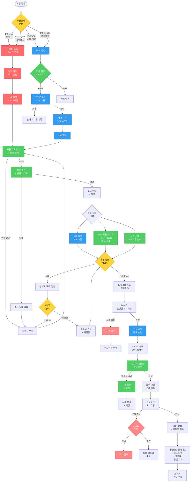

# 개선된 개발 워크플로우

## 주요 개선 사항
1. ✅ 우선순위 기반 Fast Track 경로
2. ✅ 자동화된 빌드/테스트 파이프라인
3. ✅ 병렬 검증 프로세스
4. ✅ 명확한 롤백 전략
5. ✅ SLA 및 메트릭 추적



## 주요 개선 내용

### 1. 우선순위 기반 Fast Track (🔴 빨강)
- **P0/P1**: 긴급 핫픽스 및 소규모 버그픽스
- 당직 리더 즉시 승인 (4시간 SLA)
- 간소화된 프로세스로 신속 대응

### 2. 자동화 파이프라인 (🟢 초록)
- **자동 체크리스트 검증**: 기본 요구사항 자동 확인
- **자동 코드 리뷰**: 정적 분석 + 코딩 표준 검사
- **자동 빌드/테스트**: CI/CD 파이프라인 통합
- **보안 스캔**: 취약점 자동 검출

### 3. 병렬 검증 프로세스
```
병합 후 동시 실행:
├─ 설비 검증 (2일)
├─ SQA 자동 테스트 (1일)
└─ 보안 스캔 (자동)
```
- 전체 검증 시간: 3일 → 2일로 단축

### 4. 명확한 롤백 전략 (🔴 빨강/주황)
- **스테이징 자동 롤백**: 24시간 모니터링 후 이슈 감지 시
- **카나리 배포**: 10% 트래픽으로 점진적 배포
- **자동 롤백**: 에러율 임계값 초과 시 즉시 롤백
- **블루-그린 배포**: 무중단 전환 및 빠른 롤백

### 5. SLA 및 메트릭 추적
| 단계 | SLA | 메트릭 |
|------|-----|--------|
| Fast Track 전체 | 4시간 | 긴급 대응 시간 |
| WISE 검토 | 1일 | 승인율, 반려 사유 |
| 리더 승인 | 0.5일 | 병목 시간 |
| 설비 검증 | 2일 | 테스트 커버리지 |
| SQA 테스트 | 1일 | 결함 발견율 |

### 6. 의사결정 지점 명확화 (🟡 노랑)
- **우선순위 분류**: P0~P3 자동 분류
- **통합 검증 게이트**: 모든 테스트 결과 종합 판단
- **심각도 분석**: Critical/Minor 자동 분류
- **긴급도 평가**: 롤백 우선순위 결정

## 프로세스 비교

| 항목 | 기존 | 개선 |
|------|------|------|
| 긴급 대응 | 불명확 | Fast Track 4시간 |
| 승인 단계 | 3단계 필수 | 우선순위별 차등 |
| 테스트 시간 | 순차 3일+ | 병렬 2일 |
| 자동화율 | ~20% | ~70% |
| 롤백 시간 | 수동 수시간 | 자동 5분 |
| 메트릭 가시성 | 없음 | 실시간 대시보드 |

## 기대 효과

### 속도 개선
- Fast Track: 일반 프로세스 대비 **80% 시간 단축**
- 병렬 검증: **33% 검증 시간 단축**
- 자동화: **50% 수작업 감소**

### 품질 개선
- 자동 코드 리뷰: **40% 결함 사전 차단**
- 병렬 검증: **검증 범위 확대**
- 보안 스캔: **취약점 사전 발견**

### 안정성 개선
- 카나리 배포: **프로덕션 리스크 90% 감소**
- 자동 롤백: **장애 시간 95% 단축**
- 모니터링: **문제 조기 발견**

## 구현 우선순위

### Phase 1 (1개월)
1. Fast Track 프로세스 정의
2. 우선순위 분류 기준 수립
3. 자동 빌드/테스트 파이프라인

### Phase 2 (2개월)
1. 병렬 검증 환경 구축
2. 스테이징 환경 + 모니터링
3. 자동 롤백 메커니즘

### Phase 3 (3개월)
1. 카나리/블루-그린 배포
2. 메트릭 대시보드
3. 자동 코드 리뷰 통합

